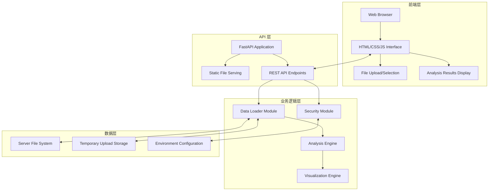

# 设计文档

## 概述

本设计文档详细描述了 web 数据分析报告工具的技术架构和实现方案。该工具采用前后端分离架构，使用 FastAPI 作为后端框架，Polars 进行高性能数据处理，Plotly 生成交互式可视化，为用户提供零配置的时序数据分析体验。

## 架构

### 整体架构



### 技术栈架构

- **Web 框架**: FastAPI - 提供高性能异步 API 服务
- **数据处理**: Polars - 高性能 DataFrame 操作
- **统计分析**: statsmodels - ADF 检验等统计功能
- **可视化**: Plotly - 交互式图表生成
- **服务器**: uvicorn - ASGI 服务器
- **前端**: 原生 HTML/CSS/JavaScript - 轻量级交互界面

## 组件和接口

### 1. FastAPI 应用主体 (main.py)

**职责**: 应用入口点，路由定义，中间件配置

**核心接口**:
```python
# 静态文件服务
app.mount("/static", StaticFiles(directory="static"), name="static")

# 主要 API 端点
@app.get("/")  # 主页面
@app.get("/api/list-files")  # 服务器文件列表
@app.post("/api/analyze-server-file")  # 分析服务器文件
@app.post("/api/upload-and-analyze")  # 上传并分析文件
```

**配置管理**:
- 通过环境变量 `DATA_DIRECTORY` 配置安全文件目录
- 支持 CORS 配置用于开发环境
- 异常处理中间件统一错误响应格式

### 2. 安全模块 (src/reporter/security.py)

**职责**: 文件路径验证，防止路径遍历攻击

**核心功能**:
```python
def validate_path(file_path: str, base_directory: str) -> bool:
    """验证文件路径是否在安全目录内"""
    
def sanitize_filename(filename: str) -> str:
    """清理文件名，移除危险字符"""
    
def is_allowed_file_type(filename: str) -> bool:
    """检查文件类型是否被允许（CSV/Parquet）"""
```

**安全策略**:
- 所有文件操作限制在 `DATA_DIRECTORY` 内
- 拒绝包含 `..` 的路径请求
- 文件名白名单验证
- 文件大小限制（默认 100MB）

### 3. 数据加载模块 (src/reporter/data_loader.py)

**职责**: 文件读取，数据预处理，时间列识别

**核心接口**:
```python
def load_data_file(file_path: str) -> pl.DataFrame:
    """加载 CSV 或 Parquet 文件"""
    
def detect_time_column(df: pl.DataFrame) -> Optional[str]:
    """自动检测时间列"""
    
def prepare_analysis_data(df: pl.DataFrame) -> Dict[str, Any]:
    """准备分析数据，分离时间列和数值列"""
```

**时间列检测逻辑**:
1. 检查列名是否匹配 `DateTime|tagTime|timestamp|time` 模式
2. 检查第一列数据类型是否为 datetime
3. 尝试解析字符串列为日期时间格式
4. 返回检测到的时间列名或 None

### 4. 分析引擎 (src/reporter/analysis/)

#### 时间序列分析 (time_series.py)
```python
def adf_stationarity_test(series: pl.Series) -> Dict[str, float]:
    """执行 ADF 平稳性检验"""
    
def calculate_time_range(time_series: pl.Series) -> Dict[str, str]:
    """计算时间范围"""
```

#### 相关性分析 (correlation.py)
```python
def calculate_correlation_matrix(df: pl.DataFrame) -> pl.DataFrame:
    """计算相关系数矩阵"""
    
def descriptive_statistics(df: pl.DataFrame) -> Dict[str, Dict]:
    """计算描述性统计"""
    
def missing_value_analysis(df: pl.DataFrame) -> Dict[str, Dict]:
    """缺失值分析"""
```

### 5. 可视化引擎 (src/reporter/visualization/charts.py)

**职责**: 生成 Plotly 交互式图表

**核心接口**:
```python
def create_time_series_plot(df: pl.DataFrame, time_col: str, value_cols: List[str]) -> Dict:
    """创建时序图表"""
    
def create_correlation_heatmap(corr_matrix: pl.DataFrame) -> Dict:
    """创建相关性热力图"""
    
def create_distribution_plots(df: pl.DataFrame, columns: List[str]) -> List[Dict]:
    """创建分布直方图"""
    
def create_box_plots(df: pl.DataFrame, columns: List[str]) -> List[Dict]:
    """创建箱形图"""
```

**图表配置**:
- 所有图表返回 Plotly JSON 格式
- 统一的颜色主题和样式
- 响应式图表尺寸
- 交互功能：缩放、平移、悬停提示

### 6. 前端界面 (templates/index.html + static/)

**主要组件**:
- 文件上传区域（拖拽支持）
- 服务器文件浏览器
- 分析进度指示器
- 结果展示区域（动态生成）

**JavaScript 功能** (static/app.js):
```javascript
// API 调用函数
async function listServerFiles()
async function analyzeServerFile(filename)
async function uploadAndAnalyze(file)

// UI 更新函数
function displayAnalysisResults(results)
function showLoadingState()
function showErrorMessage(error)
```

## 数据模型

### API 响应格式

**文件列表响应**:
```json
{
  "files": [
    {
      "name": "data.csv",
      "size": 1024000,
      "modified": "2024-01-15T10:30:00Z"
    }
  ]
}
```

**分析结果响应**:
```json
{
  "success": true,
  "data": {
    "file_info": {
      "name": "data.csv",
      "rows": 1000,
      "columns": 5
    },
    "time_info": {
      "time_column": "DateTime",
      "time_range": {
        "start": "2024-01-01T00:00:00Z",
        "end": "2024-01-31T23:59:59Z"
      }
    },
    "statistics": {
      "column_name": {
        "mean": 10.5,
        "std": 2.3,
        "min": 5.0,
        "max": 15.0,
        "missing_count": 0,
        "missing_percentage": 0.0
      }
    },
    "stationarity_tests": {
      "column_name": {
        "adf_statistic": -3.5,
        "p_value": 0.01,
        "is_stationary": true
      }
    },
    "visualizations": {
      "time_series": {...},  // Plotly JSON
      "correlation_heatmap": {...},  // Plotly JSON
      "distributions": [...],  // Array of Plotly JSON
      "box_plots": [...]  // Array of Plotly JSON
    }
  }
}
```

## 错误处理

### HTTP 状态码策略

- **200 OK**: 成功分析
- **400 Bad Request**: 文件格式错误、参数无效
- **404 Not Found**: 文件不存在
- **413 Payload Too Large**: 文件过大
- **422 Unprocessable Entity**: 数据格式无法解析
- **500 Internal Server Error**: 服务器内部错误

### 错误响应格式

```json
{
  "success": false,
  "error": {
    "code": "INVALID_FILE_FORMAT",
    "message": "不支持的文件格式，请上传 CSV 或 Parquet 文件",
    "details": "支持的格式: .csv, .parquet"
  }
}
```

### 异常处理策略

1. **文件级异常**: 文件不存在、格式错误、权限问题
2. **数据级异常**: 数据解析失败、列类型错误、空数据集
3. **分析级异常**: 统计计算失败、内存不足
4. **系统级异常**: 服务器错误、超时

## 测试策略

### 单元测试

**数据加载模块测试**:
- 测试 CSV/Parquet 文件读取
- 测试时间列自动检测
- 测试数据类型转换

**安全模块测试**:
- 测试路径遍历攻击防护
- 测试文件类型验证
- 测试文件大小限制

**分析模块测试**:
- 测试统计计算准确性
- 测试 ADF 检验结果
- 测试相关性计算

### 集成测试

**API 端点测试**:
- 测试文件上传流程
- 测试服务器文件选择
- 测试分析结果返回

**端到端测试**:
- 测试完整的用户工作流
- 测试错误场景处理
- 测试性能基准

### 测试数据

准备多种测试数据集：
- 标准时序数据（正常情况）
- 包含缺失值的数据
- 非时序数据（边界情况）
- 大数据集（性能测试）
- 异常格式数据（错误处理）

## 性能考虑

### 数据处理优化

- 使用 Polars 的懒加载和流式处理
- 对大数据集进行采样分析
- 缓存重复计算结果
- 异步处理长时间运行的分析

### 内存管理

- 及时释放大型 DataFrame
- 使用生成器处理大文件
- 限制并发分析任务数量
- 监控内存使用情况

### 前端性能

- 图表懒加载和虚拟化
- 压缩静态资源
- 使用 CDN 加速 Plotly 库
- 实现客户端缓存策略