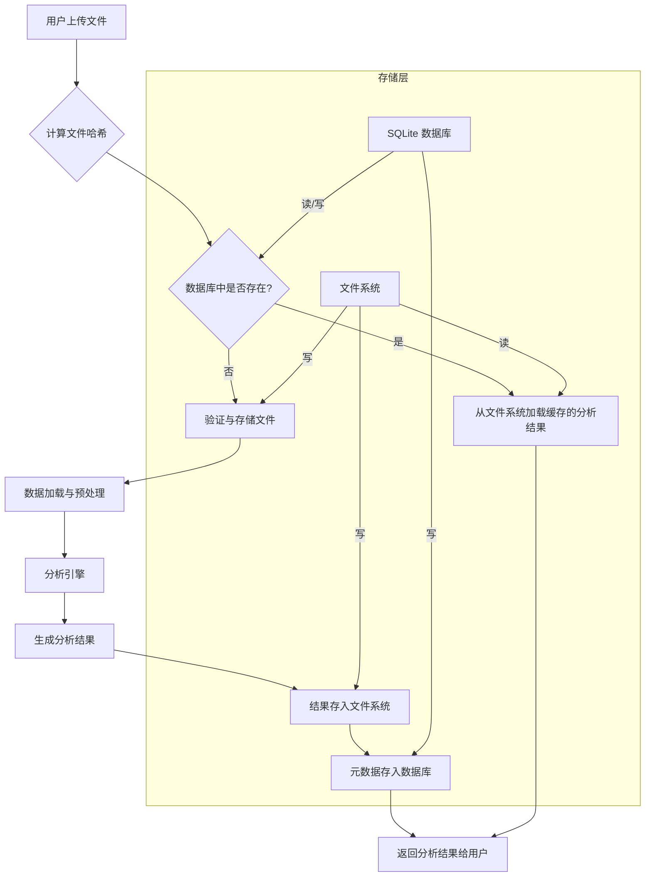
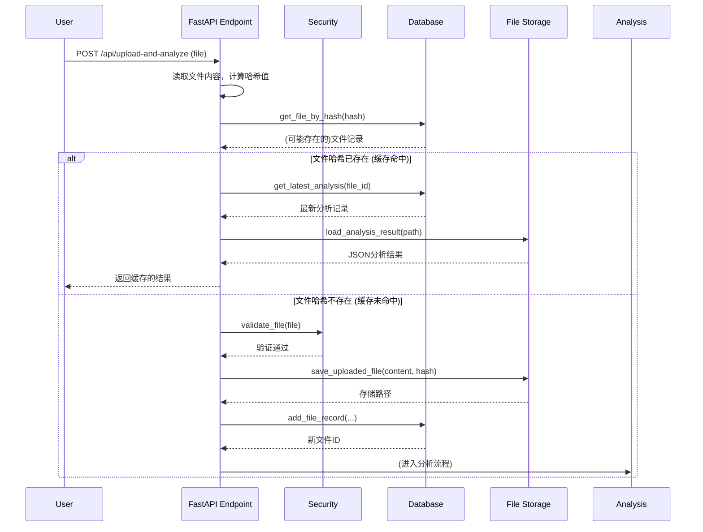
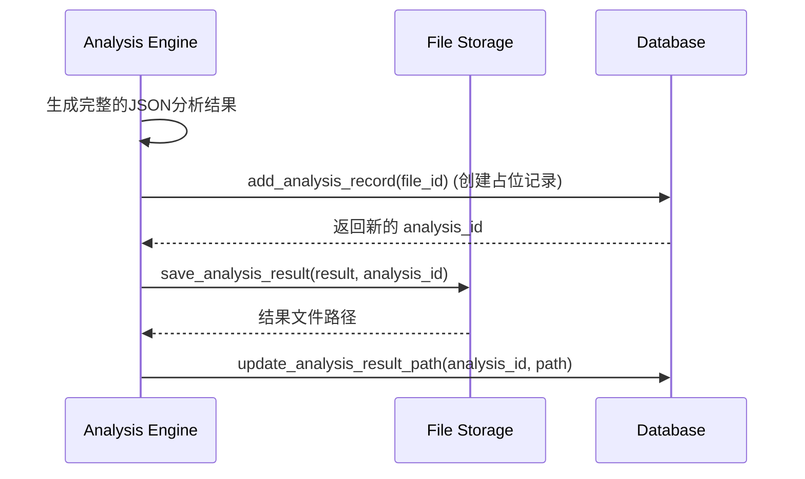

# 数据流架构

本文档详细描述数据分析报告系统的数据流架构，包括数据的输入、处理、存储和输出流程。

## 数据流概览



## 1. 数据输入与验证

### 文件上传流程



- **文件验证**: 对上传的文件进行安全检查，包括文件类型、大小限制和内容嗅探。
- **哈希计算**: 使用 SHA256 计算文件内容的哈希值，作为文件的唯一标识。
- **缓存检查**: 在数据库中查询文件哈希，如果存在，则表明该文件之前已被处理过。

## 2. 数据处理与分析

### 分析流程

```mermaid
flowchart TD
    A[新文件] --> B[数据加载 (Polars)]
    B --> C[数据预处理]
    C --> D{分析任务}
    D --> E[描述性统计]
    D --> F[缺失值分析]
    D --> G[相关性分析]
    D --> H[时间序列分析]
    E & F & G & H --> I[结果聚合]
    I --> J[生成可视化图表 (Plotly)]
    J --> K[构建最终JSON结果]
```

- **数据加载**: 使用 Polars 高效地从 CSV 或 Parquet 文件加载数据。
- **预处理**: 自动识别时间列，转换数据类型，处理基础的缺失值。
- **并行分析**: 多个分析任务（如统计、相关性）可以并行执行。
- **结果聚合**: 将所有分析模块的结果和生成的可视化图表聚合成一个单一的 JSON 对象。

## 3. 结果存储

### 存储机制

分析完成后，结果和元数据被持久化到两个地方：

1.  **文件系统**: 完整的分析结果（包括所有统计数据和图表JSON）被保存为一个独立的 `.json` 文件。这确保了结果的完整性和可移植性。
2.  **数据库 (SQLite)**: 关键的元数据被存入数据库，用于快速查询和管理。
    - `files` 表: 存储文件的基本信息（文件名、哈希、大小、路径等）。
    - `analyses` 表: 存储每次分析的记录（关联的文件ID、分析时间、结果文件路径等）。

### 存储流程



## 4. 数据输出

### API 响应

- **实时分析**: 分析完成后，完整的 JSON 结果将直接在 `POST /api/upload-and-analyze` 的响应中返回。
- **历史查询**: 当用户请求历史记录时 (`GET /api/analysis/{analysis_id}/result`)，系统从数据库找到对应的结果文件路径，然后从文件系统读取并返回其内容。

### 数据模型

- **FileRecord**: 对应数据库中的 `files` 表，代表一个文件。
- **AnalysisRecord**: 对应数据库中的 `analyses` 表，代表一次分析。
- **AnalysisResult**: 存储在文件系统中的综合性 JSON 对象。

## 5. 错误处理

在数据流的每个阶段都设计了错误处理机制：

- **上传阶段**: 捕获文件类型、大小等错误。
- **处理阶段**: 捕获数据格式、内存不足等分析错误。
- **存储阶段**: 处理数据库写入失败或文件系统权限问题。

所有错误都会被记录，并向用户返回结构化的错误信息。
