# 数据流架构

本文档详细描述数据分析报告系统的数据流架构，包括数据的输入、处理、存储和输出流程。

## 数据流概览

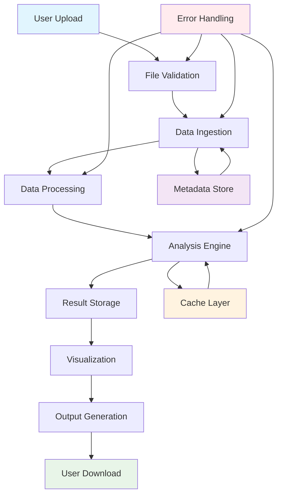

## 数据输入层

### 文件上传流程

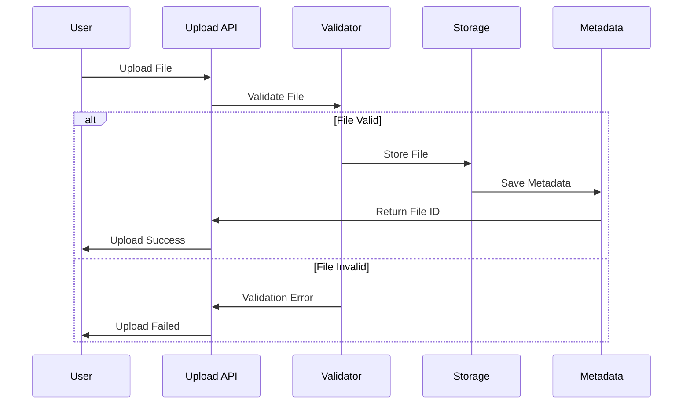

### 支持的数据格式

| 格式 | 扩展名 | 描述 | 最大大小 |
|------|--------|------|----------|
| CSV | .csv | 逗号分隔值文件 | 1GB |
| Parquet | .parquet | 列式存储格式 | 500MB |
| Excel | .xlsx, .xls | Excel工作簿 | 50MB |
| JSON | .json | JSON数据文件 | 1GB |

### 文件验证规则

```python
# 文件验证流程
class FileValidator:
    def validate_file(self, file_path: Path) -> ValidationResult:
        checks = [
            self._check_file_size,
            self._check_file_format,
            self._check_file_structure,
            self._check_data_quality,
            self._check_security
        ]
        
        for check in checks:
            result = check(file_path)
            if not result.is_valid:
                return result
        
        return ValidationResult(is_valid=True)
```

## 数据处理层

### 数据加载流程

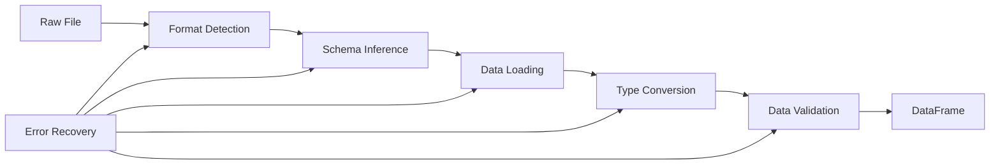

### 数据转换管道

```python
# 数据转换管道
class DataPipeline:
    def __init__(self):
        self.transformers = [
            DataTypeInferencer(),
            MissingValueHandler(),
            OutlierDetector(),
            DataNormalizer(),
            FeatureExtractor()
        ]
    
    def process(self, df: pl.DataFrame) -> ProcessedData:
        metadata = {}
        
        for transformer in self.transformers:
            df, transform_metadata = transformer.transform(df)
            metadata.update(transform_metadata)
        
        return ProcessedData(dataframe=df, metadata=metadata)
```

### 数据质量检查

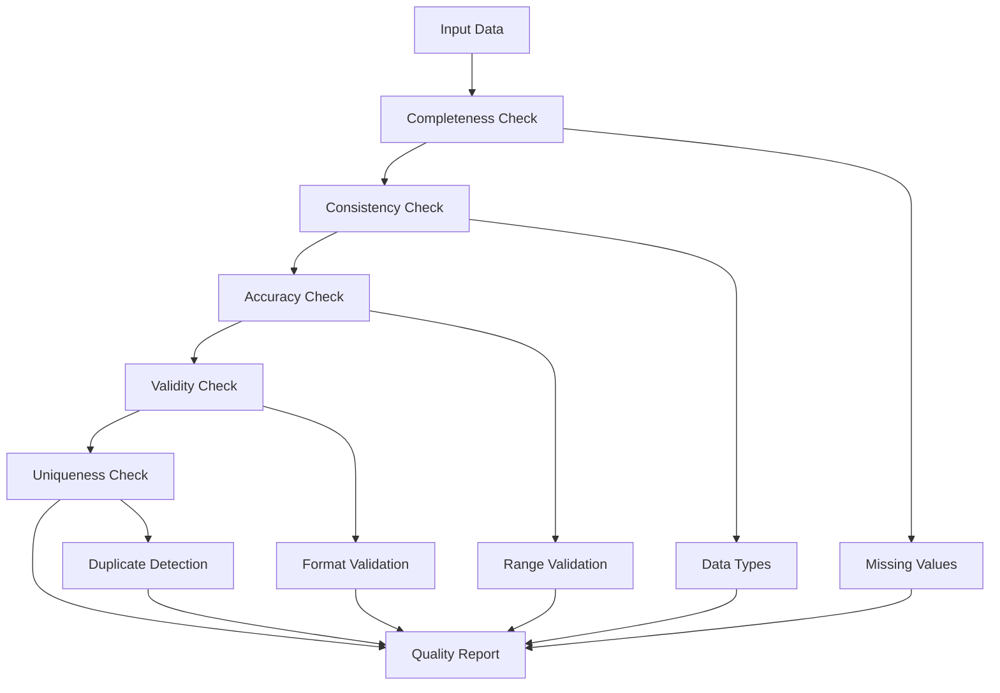

## 分析引擎

### 分析流程架构

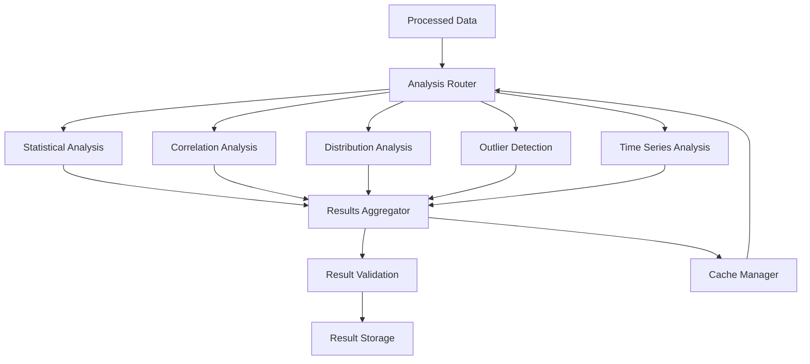

### 分析模块详细设计

#### 统计分析模块

```python
class StatisticalAnalyzer:
    def analyze(self, df: pl.DataFrame) -> AnalysisResult:
        numeric_cols = df.select(pl.col(pl.NUMERIC_DTYPES)).columns
        
        results = {}
        for col in numeric_cols:
            results[col] = {
                'descriptive_stats': self._descriptive_stats(df[col]),
                'distribution_tests': self._distribution_tests(df[col]),
                'confidence_intervals': self._confidence_intervals(df[col])
            }
        
        return AnalysisResult(
            type='statistical',
            results=results,
            metadata=self._generate_metadata(df)
        )
```

#### 相关性分析模块

```python
class CorrelationAnalyzer:
    def analyze(self, df: pl.DataFrame) -> AnalysisResult:
        numeric_df = df.select(pl.col(pl.NUMERIC_DTYPES))
        
        # 计算不同类型的相关系数
        correlations = {
            'pearson': self._pearson_correlation(numeric_df),
            'spearman': self._spearman_correlation(numeric_df),
            'kendall': self._kendall_correlation(numeric_df)
        }
        
        # 相关性显著性测试
        significance_tests = self._significance_tests(numeric_df)
        
        return AnalysisResult(
            type='correlation',
            results={
                'correlations': correlations,
                'significance': significance_tests,
                'heatmap_data': self._prepare_heatmap_data(correlations['pearson'])
            }
        )
```

### 并行处理架构

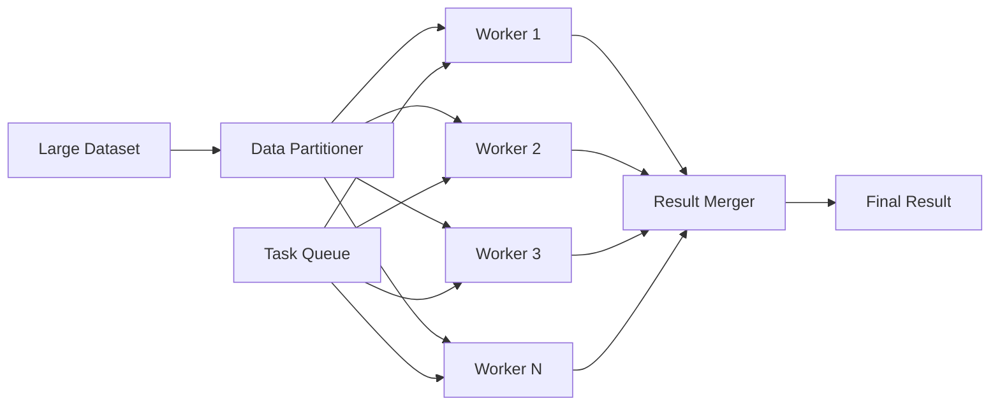

## 缓存层架构

### 多级缓存策略

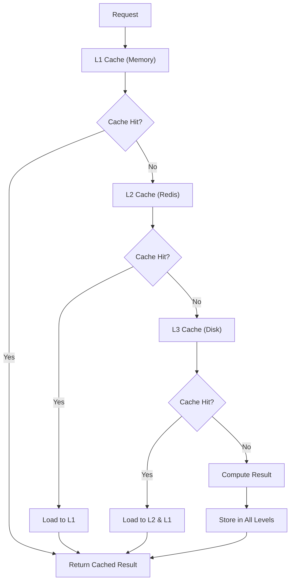

### 缓存键策略

```python
class CacheKeyGenerator:
    def generate_key(self, file_hash: str, analysis_type: str, 
                    parameters: Dict) -> str:
        # 生成确定性的缓存键
        param_hash = hashlib.md5(
            json.dumps(parameters, sort_keys=True).encode()
        ).hexdigest()
        
        return f"{file_hash}:{analysis_type}:{param_hash}"
    
    def generate_file_hash(self, file_path: Path) -> str:
        # 基于文件内容和修改时间生成哈希
        stat = file_path.stat()
        content_sample = file_path.read_bytes()[:1024]  # 前1KB
        
        hash_input = f"{stat.st_size}:{stat.st_mtime}:{content_sample}"
        return hashlib.sha256(hash_input.encode()).hexdigest()
```

## 结果存储层

### 存储架构

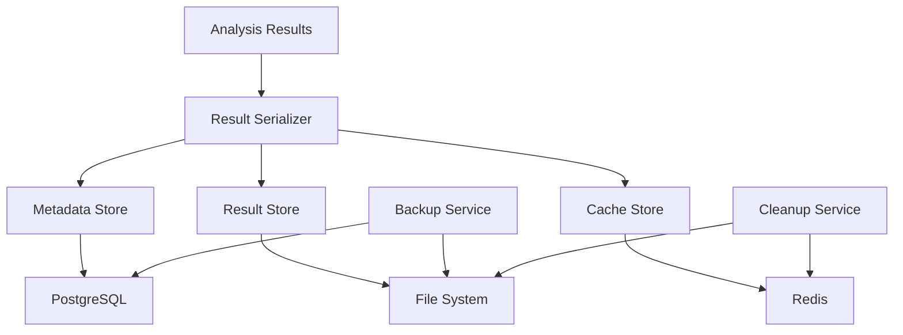

### 数据模型

```python
# 分析结果数据模型
class AnalysisResult(BaseModel):
    id: str
    file_id: str
    analysis_type: str
    status: AnalysisStatus
    results: Dict[str, Any]
    metadata: AnalysisMetadata
    created_at: datetime
    completed_at: Optional[datetime]
    error_message: Optional[str]

class AnalysisMetadata(BaseModel):
    file_info: FileInfo
    processing_time: float
    memory_usage: int
    parameters: Dict[str, Any]
    version: str

class FileInfo(BaseModel):
    filename: str
    size: int
    rows: int
    columns: int
    column_types: Dict[str, str]
    hash: str
```

## 可视化数据流

### 图表生成流程

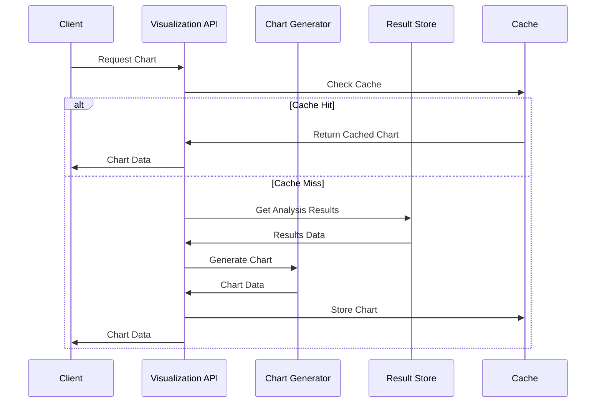

### 图表类型映射

```python
class ChartTypeMapper:
    CHART_MAPPINGS = {
        'basic_stats': {
            'numeric': ['histogram', 'box_plot', 'violin_plot'],
            'categorical': ['bar_chart', 'pie_chart']
        },
        'correlation': {
            'numeric': ['heatmap', 'scatter_matrix'],
            'mixed': ['correlation_plot']
        },
        'distribution': {
            'numeric': ['qq_plot', 'probability_plot', 'density_plot'],
            'categorical': ['frequency_plot']
        },
        'time_series': {
            'temporal': ['line_plot', 'seasonal_plot', 'trend_plot']
        }
    }
    
    def get_recommended_charts(self, analysis_type: str, 
                             data_types: List[str]) -> List[str]:
        mapping = self.CHART_MAPPINGS.get(analysis_type, {})
        
        charts = []
        for data_type in data_types:
            charts.extend(mapping.get(data_type, []))
        
        return list(set(charts))  # 去重
```

## 输出层

### 多格式输出支持

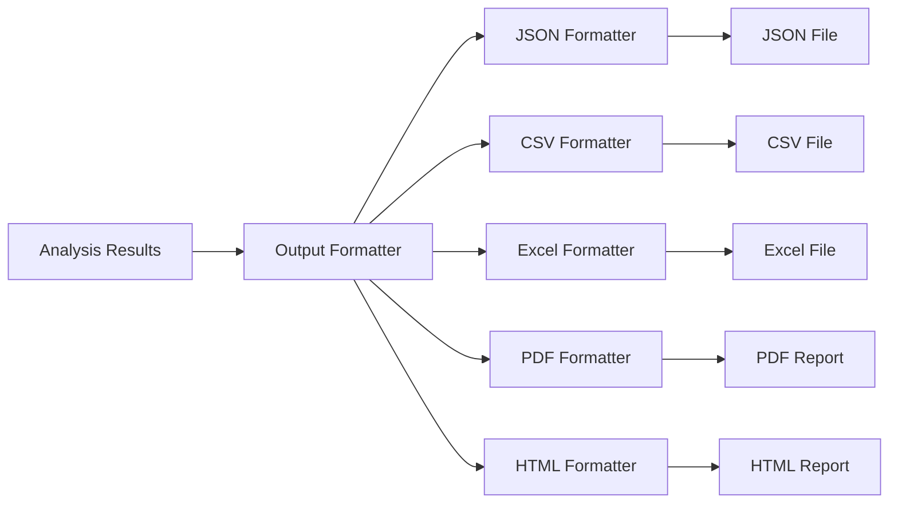

### 报告生成器

```python
class ReportGenerator:
    def __init__(self):
        self.formatters = {
            'json': JSONFormatter(),
            'csv': CSVFormatter(),
            'excel': ExcelFormatter(),
            'pdf': PDFFormatter(),
            'html': HTMLFormatter()
        }
    
    def generate_report(self, analysis_result: AnalysisResult, 
                       format_type: str) -> bytes:
        formatter = self.formatters.get(format_type)
        if not formatter:
            raise ValueError(f"Unsupported format: {format_type}")
        
        return formatter.format(analysis_result)
    
    def generate_comprehensive_report(self, 
                                    analysis_results: List[AnalysisResult]) -> bytes:
        # 生成包含所有分析结果的综合报告
        report_data = {
            'summary': self._generate_summary(analysis_results),
            'detailed_results': analysis_results,
            'visualizations': self._generate_visualizations(analysis_results),
            'recommendations': self._generate_recommendations(analysis_results)
        }
        
        return self.formatters['html'].format_comprehensive(report_data)
```

## 错误处理和恢复

### 错误处理流程

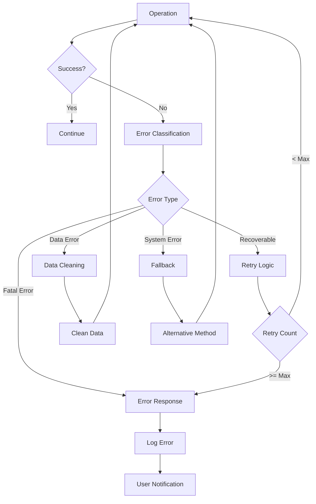

### 错误分类和处理策略

```python
class ErrorHandler:
    ERROR_STRATEGIES = {
        FileNotFoundError: 'user_error',
        PermissionError: 'system_error',
        MemoryError: 'resource_error',
        ValidationError: 'data_error',
        TimeoutError: 'retry',
        ConnectionError: 'retry'
    }
    
    def handle_error(self, error: Exception, context: Dict) -> ErrorResponse:
        strategy = self.ERROR_STRATEGIES.get(type(error), 'unknown')
        
        if strategy == 'retry':
            return self._handle_retry(error, context)
        elif strategy == 'data_error':
            return self._handle_data_error(error, context)
        elif strategy == 'resource_error':
            return self._handle_resource_error(error, context)
        else:
            return self._handle_generic_error(error, context)
```

## 监控和日志

### 数据流监控

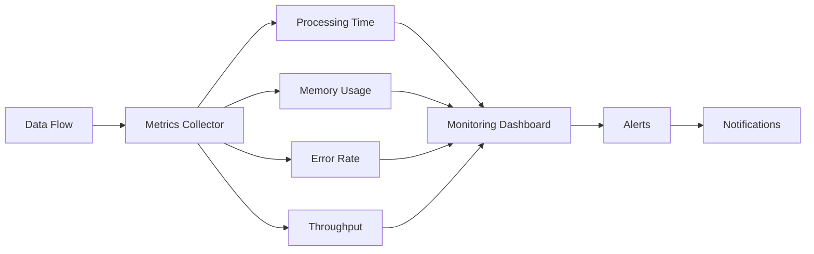

### 关键指标

| 指标类别 | 指标名称 | 描述 | 阈值 |
|----------|----------|------|------|
| 性能 | 文件处理时间 | 单个文件处理耗时 | < 30s |
| 性能 | 内存使用率 | 系统内存使用百分比 | < 80% |
| 质量 | 错误率 | 处理失败的请求比例 | < 1% |
| 容量 | 并发用户数 | 同时处理的用户数 | < 100 |
| 容量 | 存储使用率 | 磁盘空间使用百分比 | < 90% |

## 安全和隐私

### 数据安全流程

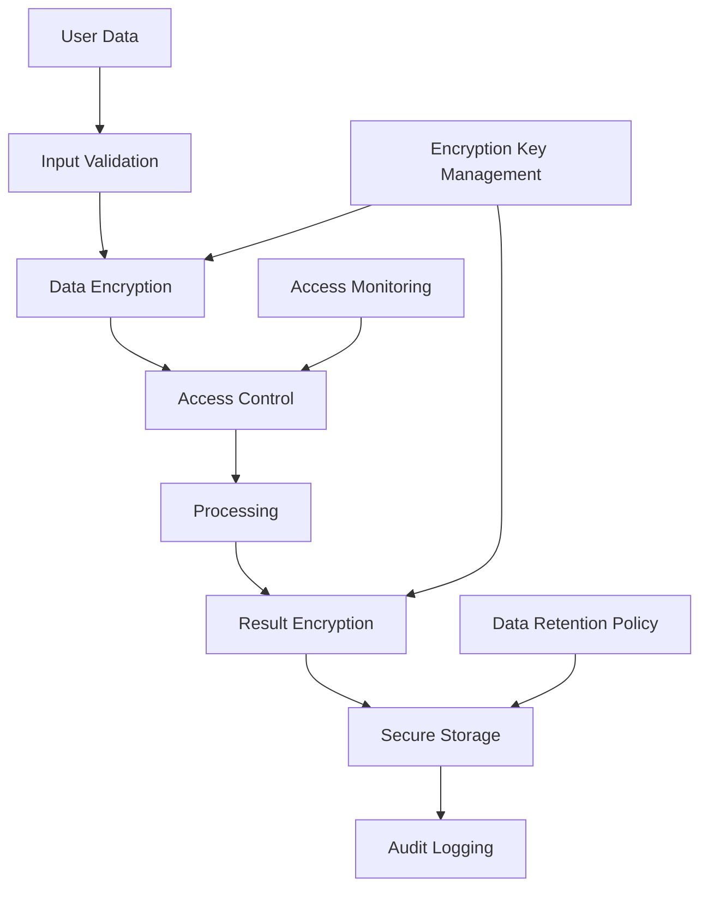

### 隐私保护措施

```python
class PrivacyProtector:
    def __init__(self):
        self.anonymizers = {
            'email': EmailAnonymizer(),
            'phone': PhoneAnonymizer(),
            'name': NameAnonymizer(),
            'address': AddressAnonymizer()
        }
    
    def protect_sensitive_data(self, df: pl.DataFrame) -> pl.DataFrame:
        # 检测敏感数据列
        sensitive_columns = self._detect_sensitive_columns(df)
        
        # 应用匿名化
        for col, data_type in sensitive_columns.items():
            anonymizer = self.anonymizers.get(data_type)
            if anonymizer:
                df = df.with_columns(
                    anonymizer.anonymize(pl.col(col)).alias(col)
                )
        
        return df
    
    def _detect_sensitive_columns(self, df: pl.DataFrame) -> Dict[str, str]:
        # 使用模式匹配和机器学习检测敏感数据
        sensitive_cols = {}
        
        for col in df.columns:
            sample_data = df[col].head(100).to_list()
            data_type = self._classify_data_type(sample_data)
            
            if data_type in self.anonymizers:
                sensitive_cols[col] = data_type
        
        return sensitive_cols
```

## 扩展性设计

### 水平扩展架构

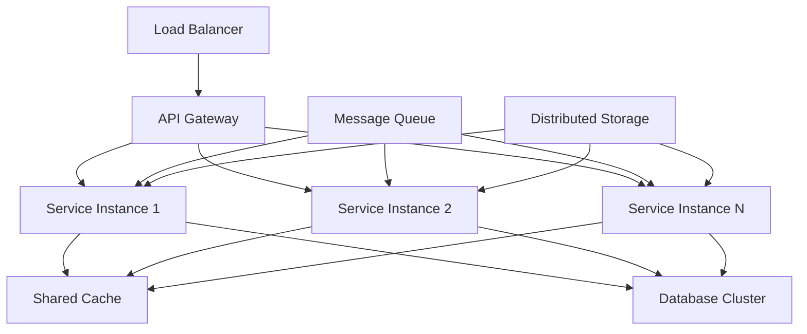

### 微服务架构

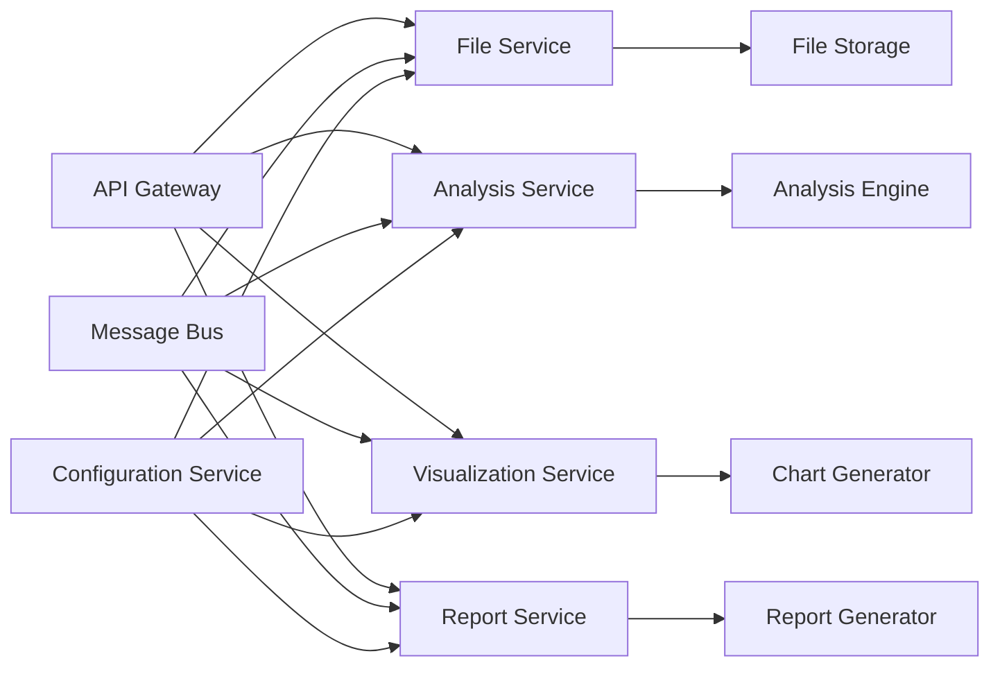

通过这个数据流架构设计，系统能够高效、安全、可扩展地处理各种数据分析需求，同时保证数据质量和用户体验。