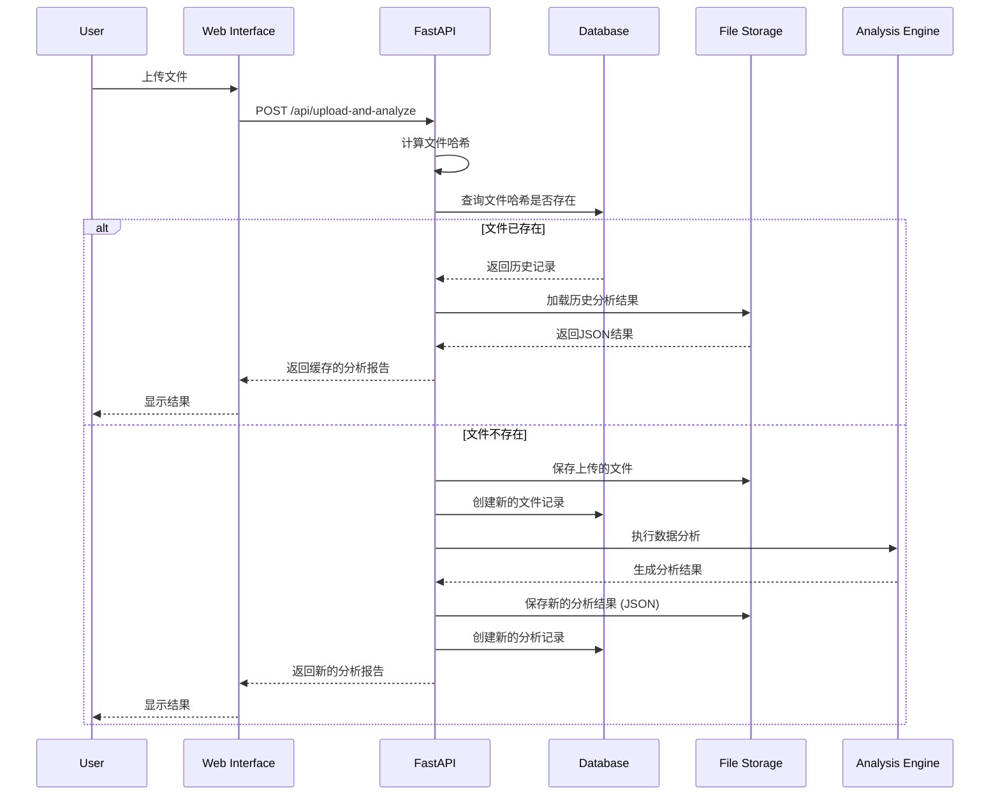

# 系统架构概览

本文档详细介绍数据分析报告系统的整体架构设计、核心组件和技术选型。

## 架构概述

数据分析报告系统采用现代化的Web应用架构，基于Python生态系统构建，提供高性能的数据处理和分析能力。

### 整体架构图

```mermaid
graph TB
    subgraph Client["客户端层"]
        A[Web浏览器]
        B[移动设备]
    end
    
    subgraph LoadBalancer["负载均衡层"]
        C[Nginx]
    end
    
    subgraph Application["应用层"]
        D[FastAPI应用]
        E[静态文件服务]
    end
    
    subgraph Business["业务逻辑层"]
        F[数据加载模块]
        G[统计分析引擎]
        H[可视化引擎]
        I[安全模块]
        M[历史记录管理器]
    end
    
    subgraph Processing["数据处理层"]
        J[Polars数据处理]
        K[NumPy数值计算]
        L[Statsmodels统计]
        P[Plotly可视化]
    end
    
    subgraph Storage["存储层"]
        N[文件系统 (上传与结果)]
        O[数据库 (SQLite)]
        Q[日志存储]
    end
    
    subgraph Monitoring["监控层"]
        R[Prometheus]
        S[日志系统]
    end
    
    A --> C
    B --> C
    C --> D
    C --> E
    D --> F
    D --> G
    D --> H
    D --> I
    D --> M
    F --> J
    G --> K
    G --> L
    H --> P
    F --> N
    M --> N
    M --> O
    D --> Q
    D --> S
```

## 核心组件

### 1. Web应用层 (FastAPI)

- **职责**: 提供HTTP API接口和Web服务。
- **核心功能**: RESTful API, 异步请求处理, 自动API文档, 请求验证, 异常处理。

### 2. 数据加载模块

- **职责**: 处理文件上传、读取和预处理。
- **核心功能**: 多格式支持 (CSV, Parquet), 编码检测, 时间列识别, 数据类型推断。

### 3. 统计分析引擎

- **职责**: 执行各种统计分析和计算。
- **核心功能**: 描述性统计, 相关性分析, 时间序列检验, 缺失值分析。

### 4. 可视化引擎

- **职责**: 生成交互式图表和可视化。
- **核心功能**: 时序图, 热力图, 分布图, 箱形图。

### 5. 安全模块

- **职责**: 确保系统安全和数据保护。
- **核心功能**: 文件类型验证, 路径遍历防护, 文件大小限制。

### 6. 历史记录与存储

- **职责**: 管理文件上传和分析的历史记录，并提供缓存功能。
- **组件**:
    - **数据库 (SQLite)**: 使用 `aiosqlite` 和 `SQLAlchemy` 存储文件元数据和分析记录。
    - **文件系统**: 存储上传的原始文件和生成的分析结果 (JSON格式)。

## 数据流架构

### 文件上传与分析流程



## 技术架构层次

- **表现层**: HTML5 + CSS3 + JavaScript, Jinja2
- **应用层**: FastAPI, Uvicorn
- **业务逻辑层**: 数据处理、统计分析、可视化、安全控制、历史管理
- **数据访问层**: 文件系统, SQLite数据库
- **基础设施层**: Python 3.11+, Docker, Nginx

## 下一步

- 了解[技术栈详情](tech-stack.md)
- 查看[数据流设计](data-flow.md)
- 阅读[API设计](../api/overview.md)
- 参考[部署架构](../deployment/deployment.md)
