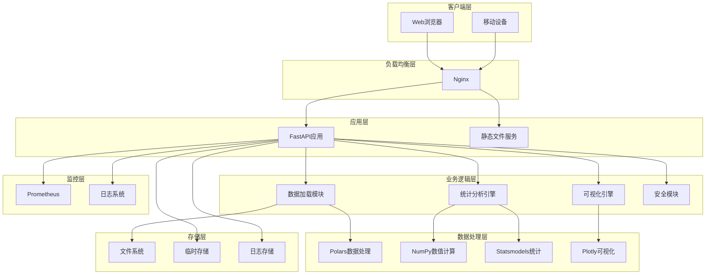
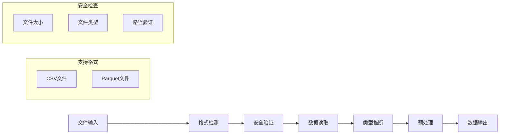
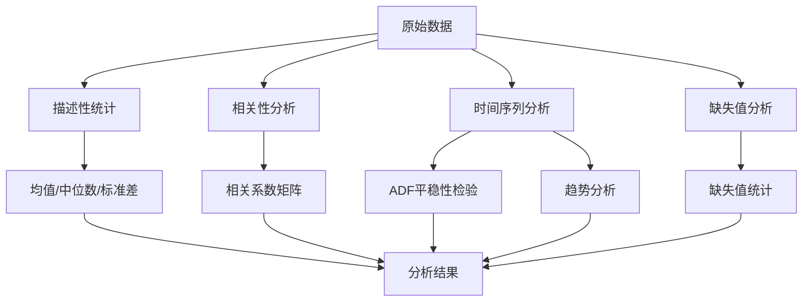
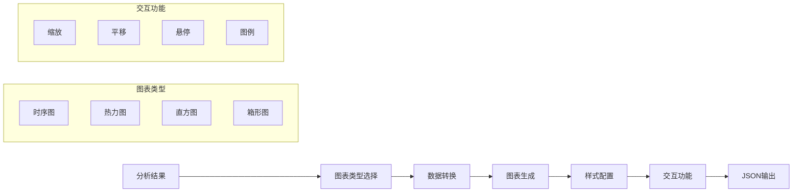
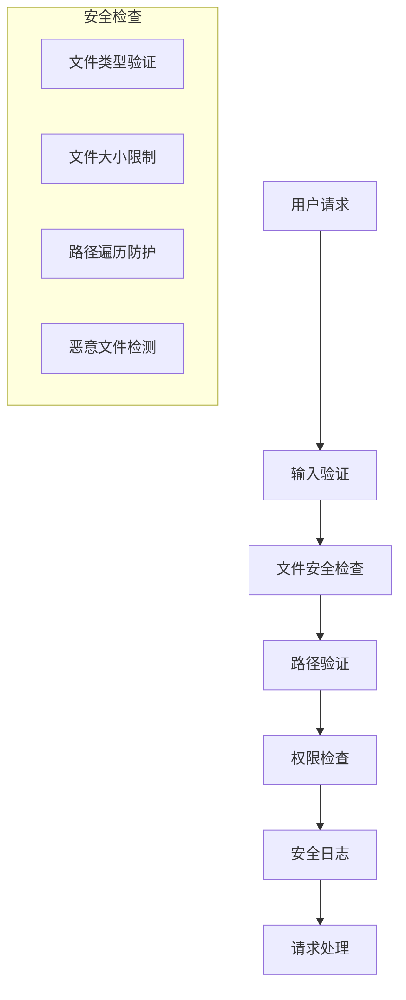
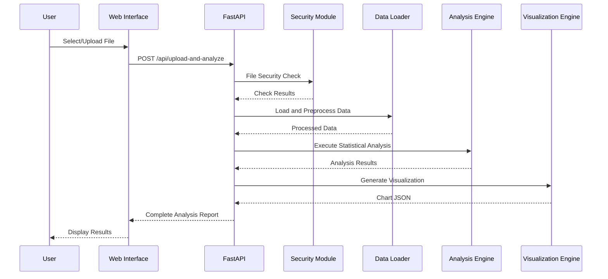
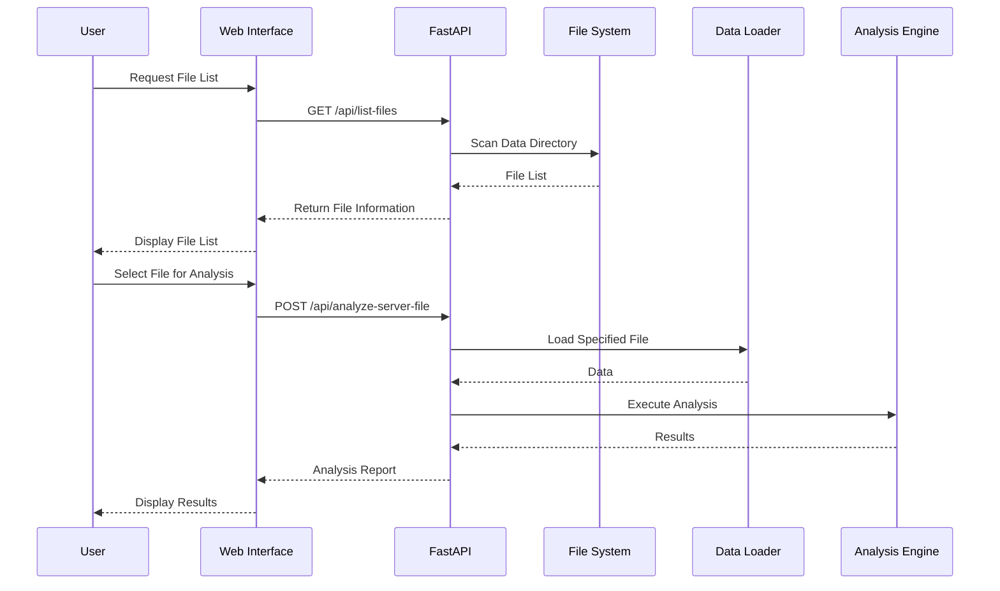
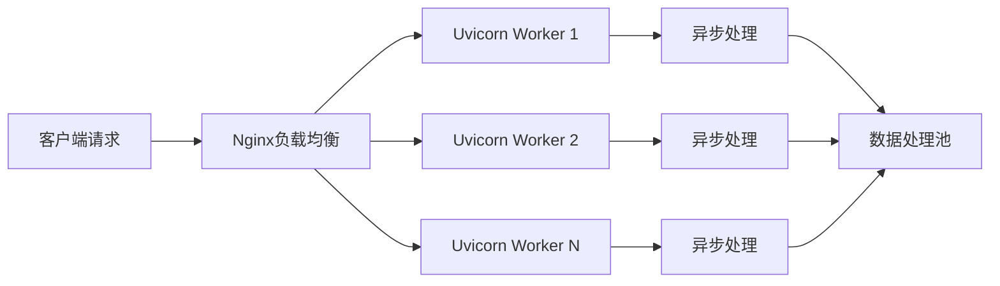

# 系统架构概览

本文档详细介绍数据分析报告系统的整体架构设计、核心组件和技术选型。

## 架构概述

数据分析报告系统采用现代化的Web应用架构，基于Python生态系统构建，提供高性能的数据处理和分析能力。

### 整体架构图



## 核心组件

### 1. Web应用层 (FastAPI)

**职责**: 提供HTTP API接口和Web服务

**核心功能**:
- RESTful API 设计
- 异步请求处理
- 自动API文档生成
- 请求验证和序列化
- 异常处理和错误响应

**技术特点**:
- 基于Python 3.11+ 类型提示
- 高性能异步框架
- 自动OpenAPI文档
- 内置数据验证

### 2. 数据加载模块

**职责**: 处理文件上传、读取和预处理



**核心功能**:
- 多格式文件支持 (CSV, Parquet)
- 智能编码检测
- 时间列自动识别
- 数据类型推断
- 内存优化处理

### 3. 统计分析引擎

**职责**: 执行各种统计分析和计算



**核心功能**:
- 描述性统计计算
- 相关性分析
- 时间序列特性检验
- 缺失值分析
- 异常值检测

### 4. 可视化引擎

**职责**: 生成交互式图表和可视化



**核心功能**:
- 时序曲线图
- 相关性热力图
- 数据分布图
- 箱形图
- 交互式功能

### 5. 安全模块

**职责**: 确保系统安全和数据保护



**核心功能**:
- 文件类型验证
- 路径遍历防护
- 文件大小限制
- 输入数据清理
- 安全日志记录

## 数据流架构

### 文件上传流程



### 服务器文件分析流程



## 技术架构层次

### 表现层 (Presentation Layer)
- **前端**: HTML5 + CSS3 + JavaScript
- **模板引擎**: Jinja2
- **静态资源**: CSS/JS文件服务
- **响应式设计**: 支持桌面和移动设备

### 应用层 (Application Layer)
- **Web框架**: FastAPI
- **路由管理**: 基于装饰器的路由
- **中间件**: CORS、异常处理、日志记录
- **API文档**: 自动生成OpenAPI规范

### 业务逻辑层 (Business Logic Layer)
- **数据处理**: 文件读取、预处理、转换
- **统计分析**: 描述性统计、时间序列分析
- **可视化**: 图表生成、样式配置
- **安全控制**: 输入验证、权限检查

### 数据访问层 (Data Access Layer)
- **文件系统**: 本地文件存储
- **内存管理**: 数据缓存和清理
- **临时存储**: 上传文件临时保存

### 基础设施层 (Infrastructure Layer)
- **运行时**: Python 3.11+ 运行环境
- **Web服务器**: Uvicorn ASGI服务器
- **反向代理**: Nginx (生产环境)
- **容器化**: Docker支持

## 性能架构

### 并发处理


### 内存管理
- **流式处理**: 大文件分块读取
- **内存监控**: 实时内存使用跟踪
- **垃圾回收**: 自动内存清理
- **缓存策略**: 智能数据缓存

### 性能优化
- **异步I/O**: 非阻塞文件操作
- **数据流水线**: 并行数据处理
- **计算优化**: 向量化操作
- **资源池化**: 连接和对象复用

## 可扩展性设计

### 水平扩展
- **无状态设计**: 应用实例无状态
- **负载均衡**: 多实例部署支持
- **分布式存储**: 支持网络文件系统

### 垂直扩展
- **多核利用**: 多进程/多线程处理
- **内存扩展**: 动态内存分配
- **计算加速**: GPU计算支持(可选)

### 功能扩展
- **插件架构**: 模块化设计
- **API扩展**: RESTful接口标准
- **数据源扩展**: 多种数据源支持

## 安全架构

### 输入安全
- **文件验证**: 类型、大小、内容检查
- **路径安全**: 防止路径遍历攻击
- **数据清理**: 输入数据净化

### 运行时安全
- **权限控制**: 最小权限原则
- **资源限制**: CPU、内存使用限制
- **异常处理**: 安全的错误响应

### 数据安全
- **临时文件**: 自动清理机制
- **敏感数据**: 内存中处理，不持久化
- **日志安全**: 敏感信息过滤

## 监控架构

### 应用监控
- **性能指标**: 响应时间、吞吐量
- **错误监控**: 异常捕获和报告
- **资源监控**: CPU、内存、磁盘使用

### 业务监控
- **用户行为**: 文件上传、分析请求
- **数据质量**: 处理成功率、错误类型
- **系统健康**: 服务可用性检查

## 部署架构

### 开发环境
```
开发机 → Python虚拟环境 → 本地文件系统
```

### 测试环境
```
测试服务器 → Docker容器 → 共享存储
```

### 生产环境
```
负载均衡器 → 多个应用实例 → 分布式存储 → 监控系统
```

## 下一步

- 了解[技术栈详情](tech-stack.md)
- 查看[数据流设计](data-flow.md)
- 阅读[API设计](../api/overview.md)
- 参考[部署架构](../deployment/deployment.md)