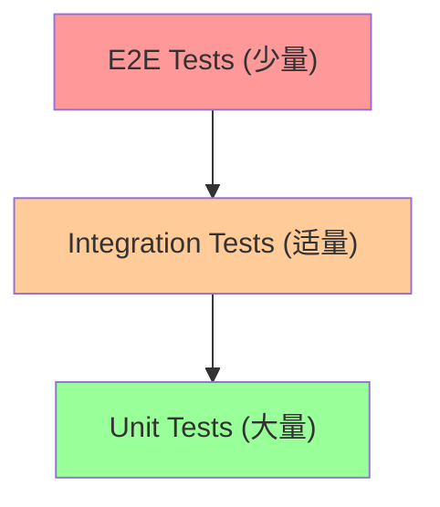

# 测试指南

本文档详细说明数据分析报告系统的测试策略、测试框架使用和最佳实践。

## 测试策略

### 测试金字塔



我们采用测试金字塔策略：

- **单元测试 (70%)**：测试单个函数和类
- **集成测试 (20%)**：测试组件间交互
- **端到端测试 (10%)**：测试完整用户流程

### 测试分类

- **功能测试**：验证功能是否按预期工作
- **性能测试**：验证系统性能指标
- **安全测试**：验证安全性和数据保护
- **兼容性测试**：验证不同环境下的兼容性

## 测试框架

### Pytest配置

```toml
# pyproject.toml
[tool.pytest.ini_options]
minversion = "6.0"
addopts = "-ra -q --strict-markers --strict-config --cov=src --cov-report=html --cov-report=term"
testpaths = [
    "tests",
]
python_files = [
    "test_*.py",
    "*_test.py",
]
python_classes = [
    "Test*",
]
python_functions = [
    "test_*",
]
markers = [
    "slow: marks tests as slow (deselect with '-m \"not slow\"')",
    "integration: marks tests as integration tests",
    "unit: marks tests as unit tests",
    "e2e: marks tests as end-to-end tests",
    "performance: marks tests as performance tests",
    "security: marks tests as security tests",
]
filterwarnings = [
    "error",
    "ignore::UserWarning",
    "ignore::DeprecationWarning",
    "ignore::PendingDeprecationWarning",
]
```

### 测试依赖

```toml
# pyproject.toml - 测试相关依赖
[project.optional-dependencies]
test = [
    "pytest>=7.0.0",
    "pytest-cov>=4.0.0",
    "pytest-asyncio>=0.21.0",
    "pytest-mock>=3.10.0",
    "pytest-xdist>=3.0.0",
    "pytest-benchmark>=4.0.0",
    "httpx>=0.24.0",
    "factory-boy>=3.2.0",
    "faker>=18.0.0",
    "freezegun>=1.2.0",
    "responses>=0.23.0",
]
```

## 测试结构

### 目录结构

```
tests/
├── conftest.py              # 全局测试配置
├── fixtures/                # 测试数据和夹具
│   ├── __init__.py
│   ├── data_fixtures.py
│   └── sample_data/
│       ├── test_data.csv
│       └── test_data.parquet
├── unit/                    # 单元测试
│   ├── __init__.py
│   ├── test_data_loader.py
│   ├── test_analysis/
│   │   ├── test_stats.py
│   │   └── test_visualization.py
│   └── test_utils/
│       └── test_helpers.py
├── integration/             # 集成测试
│   ├── __init__.py
│   ├── test_api_endpoints.py
│   └── test_data_pipeline.py
├── e2e/                     # 端到端测试
│   ├── __init__.py
│   └── test_user_workflows.py
├── performance/             # 性能测试
│   ├── __init__.py
│   └── test_performance.py
└── security/                # 安全测试
    ├── __init__.py
    └── test_security.py
```

### 全局配置

```python
# tests/conftest.py
import pytest
import tempfile
import shutil
from pathlib import Path
from fastapi.testclient import TestClient
from unittest.mock import Mock

from src.main import app
from src.config.settings import Settings

@pytest.fixture(scope="session")
def test_settings():
    """测试环境配置"""
    return Settings(
        environment="test",
        debug=True,
        database_url="sqlite:///:memory:",
        data_dir="./test_data",
        upload_dir="./test_uploads",
        temp_dir="./test_temp",
        max_file_size="10MB",
        secret_key="test-secret-key",
        log_level="DEBUG"
    )

@pytest.fixture(scope="session")
def client(test_settings):
    """测试客户端"""
    app.dependency_overrides[Settings] = lambda: test_settings
    with TestClient(app) as test_client:
        yield test_client
    app.dependency_overrides.clear()

@pytest.fixture
def temp_dir():
    """临时目录"""
    temp_path = tempfile.mkdtemp()
    yield Path(temp_path)
    shutil.rmtree(temp_path)

@pytest.fixture
def sample_csv_file(temp_dir):
    """示例CSV文件"""
    import polars as pl
    
    df = pl.DataFrame({
        "id": range(1, 101),
        "name": [f"Item_{i}" for i in range(1, 101)],
        "value": [i * 1.5 for i in range(1, 101)],
        "category": ["A" if i % 2 == 0 else "B" for i in range(1, 101)]
    })
    
    file_path = temp_dir / "sample.csv"
    df.write_csv(file_path)
    return file_path

@pytest.fixture
def mock_file_upload():
    """模拟文件上传"""
    from io import BytesIO
    
    content = b"id,name,value\n1,Test,10.5\n2,Test2,20.0"
    return BytesIO(content)
```

## 单元测试

### 数据加载器测试

```python
# tests/unit/test_data_loader.py
import pytest
import polars as pl
from pathlib import Path
from unittest.mock import Mock, patch

from src.data_loader import DataLoader, DataLoaderError

class TestDataLoader:
    """数据加载器测试"""
    
    def test_load_csv_success(self, sample_csv_file):
        """测试成功加载CSV文件"""
        loader = DataLoader()
        df = loader.load_csv(sample_csv_file)
        
        assert isinstance(df, pl.DataFrame)
        assert len(df) == 100
        assert df.columns == ["id", "name", "value", "category"]
    
    def test_load_csv_file_not_found(self):
        """测试文件不存在的情况"""
        loader = DataLoader()
        
        with pytest.raises(DataLoaderError, match="File not found"):
            loader.load_csv("nonexistent.csv")
    
    def test_load_csv_invalid_format(self, temp_dir):
        """测试无效CSV格式"""
        # 创建无效CSV文件
        invalid_file = temp_dir / "invalid.csv"
        invalid_file.write_text("invalid,csv,content\nwith,missing,")
        
        loader = DataLoader()
        
        with pytest.raises(DataLoaderError, match="Invalid CSV format"):
            loader.load_csv(invalid_file)
    
    def test_load_parquet_success(self, temp_dir):
        """测试成功加载Parquet文件"""
        # 创建测试Parquet文件
        df = pl.DataFrame({
            "col1": [1, 2, 3],
            "col2": ["a", "b", "c"]
        })
        parquet_file = temp_dir / "test.parquet"
        df.write_parquet(parquet_file)
        
        loader = DataLoader()
        loaded_df = loader.load_parquet(parquet_file)
        
        assert isinstance(loaded_df, pl.DataFrame)
        assert loaded_df.equals(df)
    
    @patch('src.data_loader.pl.read_csv')
    def test_load_csv_with_options(self, mock_read_csv, sample_csv_file):
        """测试带选项的CSV加载"""
        mock_df = Mock(spec=pl.DataFrame)
        mock_read_csv.return_value = mock_df
        
        loader = DataLoader()
        options = {
            "separator": ";",
            "has_header": False,
            "encoding": "utf-8"
        }
        
        result = loader.load_csv(sample_csv_file, **options)
        
        mock_read_csv.assert_called_once_with(
            sample_csv_file,
            separator=";",
            has_header=False,
            encoding="utf-8"
        )
        assert result == mock_df
    
    def test_validate_file_size(self, temp_dir):
        """测试文件大小验证"""
        # 创建大文件
        large_file = temp_dir / "large.csv"
        large_content = "col1,col2\n" + "data,data\n" * 100000
        large_file.write_text(large_content)
        
        loader = DataLoader(max_file_size="1KB")  # 设置很小的限制
        
        with pytest.raises(DataLoaderError, match="File size exceeds limit"):
            loader.load_csv(large_file)
    
    def test_detect_encoding(self, temp_dir):
        """测试编码检测"""
        # 创建不同编码的文件
        utf8_file = temp_dir / "utf8.csv"
        utf8_file.write_text("名称,值\n测试,123", encoding="utf-8")
        
        loader = DataLoader()
        encoding = loader.detect_encoding(utf8_file)
        
        assert encoding == "utf-8"
```

### 统计分析测试

```python
# tests/unit/test_analysis/test_stats.py
import pytest
import polars as pl
import numpy as np
from unittest.mock import Mock

from src.analysis.stats import StatisticalAnalyzer, AnalysisError

class TestStatisticalAnalyzer:
    """统计分析器测试"""
    
    @pytest.fixture
    def sample_data(self):
        """示例数据"""
        return pl.DataFrame({
            "numeric1": [1.0, 2.0, 3.0, 4.0, 5.0],
            "numeric2": [2.0, 4.0, 6.0, 8.0, 10.0],
            "categorical": ["A", "B", "A", "B", "A"],
            "text": ["hello", "world", "test", "data", "analysis"]
        })
    
    def test_basic_statistics(self, sample_data):
        """测试基础统计"""
        analyzer = StatisticalAnalyzer()
        result = analyzer.basic_statistics(sample_data)
        
        assert "numeric1" in result
        assert "numeric2" in result
        assert "categorical" not in result  # 分类变量不应包含在数值统计中
        
        numeric1_stats = result["numeric1"]
        assert numeric1_stats["mean"] == 3.0
        assert numeric1_stats["median"] == 3.0
        assert numeric1_stats["std"] == pytest.approx(1.58, rel=1e-2)
        assert numeric1_stats["min"] == 1.0
        assert numeric1_stats["max"] == 5.0
    
    def test_correlation_analysis(self, sample_data):
        """测试相关性分析"""
        analyzer = StatisticalAnalyzer()
        result = analyzer.correlation_analysis(sample_data)
        
        assert "correlation_matrix" in result
        assert "significant_correlations" in result
        
        corr_matrix = result["correlation_matrix"]
        assert corr_matrix["numeric1"]["numeric2"] == 1.0  # 完全正相关
    
    def test_distribution_analysis(self, sample_data):
        """测试分布分析"""
        analyzer = StatisticalAnalyzer()
        result = analyzer.distribution_analysis(sample_data)
        
        assert "numeric1" in result
        assert "numeric2" in result
        
        numeric1_dist = result["numeric1"]
        assert "normality_test" in numeric1_dist
        assert "skewness" in numeric1_dist
        assert "kurtosis" in numeric1_dist
    
    def test_outlier_detection(self, sample_data):
        """测试异常值检测"""
        # 添加异常值
        data_with_outliers = sample_data.with_columns(
            pl.col("numeric1").list.concat([100.0]).alias("numeric1")
        )
        
        analyzer = StatisticalAnalyzer()
        result = analyzer.detect_outliers(data_with_outliers)
        
        assert "numeric1" in result
        assert len(result["numeric1"]["outlier_indices"]) > 0
    
    def test_empty_dataframe(self):
        """测试空数据框"""
        empty_df = pl.DataFrame()
        analyzer = StatisticalAnalyzer()
        
        with pytest.raises(AnalysisError, match="Empty dataframe"):
            analyzer.basic_statistics(empty_df)
    
    def test_no_numeric_columns(self):
        """测试无数值列的情况"""
        text_only_df = pl.DataFrame({
            "text1": ["a", "b", "c"],
            "text2": ["x", "y", "z"]
        })
        
        analyzer = StatisticalAnalyzer()
        result = analyzer.basic_statistics(text_only_df)
        
        assert len(result) == 0  # 应该返回空结果
    
    @pytest.mark.parametrize("method", ["iqr", "zscore", "isolation_forest"])
    def test_outlier_detection_methods(self, sample_data, method):
        """测试不同的异常值检测方法"""
        analyzer = StatisticalAnalyzer()
        result = analyzer.detect_outliers(sample_data, method=method)
        
        assert isinstance(result, dict)
        for col_result in result.values():
            assert "outlier_indices" in col_result
            assert "outlier_scores" in col_result
```

## 集成测试

### API端点测试

```python
# tests/integration/test_api_endpoints.py
import pytest
from fastapi.testclient import TestClient
from io import BytesIO

class TestAPIEndpoints:
    """API端点集成测试"""
    
    def test_health_check(self, client: TestClient):
        """测试健康检查端点"""
        response = client.get("/health")
        
        assert response.status_code == 200
        assert response.json()["status"] == "healthy"
    
    def test_upload_csv_file(self, client: TestClient):
        """测试CSV文件上传"""
        csv_content = b"id,name,value\n1,Test,10.5\n2,Test2,20.0"
        files = {"file": ("test.csv", BytesIO(csv_content), "text/csv")}
        
        response = client.post("/upload", files=files)
        
        assert response.status_code == 200
        data = response.json()
        assert "file_id" in data
        assert data["filename"] == "test.csv"
        assert data["rows"] == 2
        assert data["columns"] == 3
    
    def test_upload_invalid_file(self, client: TestClient):
        """测试上传无效文件"""
        invalid_content = b"not a csv file"
        files = {"file": ("test.txt", BytesIO(invalid_content), "text/plain")}
        
        response = client.post("/upload", files=files)
        
        assert response.status_code == 400
        assert "Invalid file format" in response.json()["detail"]
    
    def test_analyze_data(self, client: TestClient):
        """测试数据分析"""
        # 首先上传文件
        csv_content = b"id,value\n1,10\n2,20\n3,30\n4,40\n5,50"
        files = {"file": ("test.csv", BytesIO(csv_content), "text/csv")}
        upload_response = client.post("/upload", files=files)
        file_id = upload_response.json()["file_id"]
        
        # 然后分析数据
        analysis_request = {
            "file_id": file_id,
            "analysis_type": "basic_stats"
        }
        
        response = client.post("/analyze", json=analysis_request)
        
        assert response.status_code == 200
        data = response.json()
        assert "results" in data
        assert "basic_statistics" in data["results"]
    
    def test_get_analysis_results(self, client: TestClient):
        """测试获取分析结果"""
        # 上传并分析数据
        csv_content = b"id,value\n1,10\n2,20\n3,30"
        files = {"file": ("test.csv", BytesIO(csv_content), "text/csv")}
        upload_response = client.post("/upload", files=files)
        file_id = upload_response.json()["file_id"]
        
        analysis_request = {"file_id": file_id, "analysis_type": "basic_stats"}
        analysis_response = client.post("/analyze", json=analysis_request)
        analysis_id = analysis_response.json()["analysis_id"]
        
        # 获取结果
        response = client.get(f"/results/{analysis_id}")
        
        assert response.status_code == 200
        data = response.json()
        assert "analysis_id" in data
        assert "results" in data
        assert "created_at" in data
    
    def test_download_results(self, client: TestClient):
        """测试下载结果"""
        # 上传并分析数据
        csv_content = b"id,value\n1,10\n2,20\n3,30"
        files = {"file": ("test.csv", BytesIO(csv_content), "text/csv")}
        upload_response = client.post("/upload", files=files)
        file_id = upload_response.json()["file_id"]
        
        analysis_request = {"file_id": file_id, "analysis_type": "basic_stats"}
        analysis_response = client.post("/analyze", json=analysis_request)
        analysis_id = analysis_response.json()["analysis_id"]
        
        # 下载结果
        response = client.get(f"/download/{analysis_id}?format=json")
        
        assert response.status_code == 200
        assert response.headers["content-type"] == "application/json"
    
    def test_list_files(self, client: TestClient):
        """测试文件列表"""
        response = client.get("/files")
        
        assert response.status_code == 200
        data = response.json()
        assert "files" in data
        assert isinstance(data["files"], list)
    
    def test_delete_file(self, client: TestClient):
        """测试删除文件"""
        # 首先上传文件
        csv_content = b"id,value\n1,10\n2,20"
        files = {"file": ("test.csv", BytesIO(csv_content), "text/csv")}
        upload_response = client.post("/upload", files=files)
        file_id = upload_response.json()["file_id"]
        
        # 删除文件
        response = client.delete(f"/files/{file_id}")
        
        assert response.status_code == 200
        assert response.json()["message"] == "File deleted successfully"
        
        # 验证文件已删除
        get_response = client.get(f"/files/{file_id}")
        assert get_response.status_code == 404
```

### 数据管道测试

```python
# tests/integration/test_data_pipeline.py
import pytest
import tempfile
from pathlib import Path

from src.data_pipeline import DataPipeline
from src.data_loader import DataLoader
from src.analysis.stats import StatisticalAnalyzer
from src.visualization.charts import ChartGenerator

class TestDataPipeline:
    """数据管道集成测试"""
    
    @pytest.fixture
    def pipeline(self):
        """数据管道实例"""
        return DataPipeline(
            loader=DataLoader(),
            analyzer=StatisticalAnalyzer(),
            chart_generator=ChartGenerator()
        )
    
    def test_complete_pipeline(self, pipeline, sample_csv_file):
        """测试完整的数据管道"""
        # 执行完整管道
        result = pipeline.process_file(
            file_path=sample_csv_file,
            analysis_types=["basic_stats", "correlation", "distribution"]
        )
        
        # 验证结果结构
        assert "file_info" in result
        assert "analysis_results" in result
        assert "visualizations" in result
        
        # 验证文件信息
        file_info = result["file_info"]
        assert file_info["filename"] == sample_csv_file.name
        assert file_info["rows"] == 100
        assert file_info["columns"] == 4
        
        # 验证分析结果
        analysis_results = result["analysis_results"]
        assert "basic_stats" in analysis_results
        assert "correlation" in analysis_results
        assert "distribution" in analysis_results
        
        # 验证可视化
        visualizations = result["visualizations"]
        assert len(visualizations) > 0
        for viz in visualizations:
            assert "type" in viz
            assert "data" in viz
    
    def test_pipeline_with_invalid_file(self, pipeline):
        """测试管道处理无效文件"""
        with pytest.raises(Exception):
            pipeline.process_file(
                file_path="nonexistent.csv",
                analysis_types=["basic_stats"]
            )
    
    def test_pipeline_error_handling(self, pipeline, temp_dir):
        """测试管道错误处理"""
        # 创建空文件
        empty_file = temp_dir / "empty.csv"
        empty_file.write_text("")
        
        result = pipeline.process_file(
            file_path=empty_file,
            analysis_types=["basic_stats"]
        )
        
        # 应该包含错误信息
        assert "errors" in result
        assert len(result["errors"]) > 0
    
    def test_pipeline_caching(self, pipeline, sample_csv_file):
        """测试管道缓存功能"""
        # 第一次处理
        result1 = pipeline.process_file(
            file_path=sample_csv_file,
            analysis_types=["basic_stats"],
            use_cache=True
        )
        
        # 第二次处理（应该使用缓存）
        result2 = pipeline.process_file(
            file_path=sample_csv_file,
            analysis_types=["basic_stats"],
            use_cache=True
        )
        
        # 结果应该相同
        assert result1["analysis_results"] == result2["analysis_results"]
        
        # 第二次应该更快（从缓存中获取）
        assert result2["processing_time"] < result1["processing_time"]
```

## 端到端测试

### 用户工作流测试

```python
# tests/e2e/test_user_workflows.py
import pytest
from fastapi.testclient import TestClient
from io import BytesIO
import time

class TestUserWorkflows:
    """端到端用户工作流测试"""
    
    def test_complete_analysis_workflow(self, client: TestClient):
        """测试完整的分析工作流"""
        # 1. 上传文件
        csv_content = b"""id,name,value,category
1,Item1,10.5,A
2,Item2,20.0,B
3,Item3,15.5,A
4,Item4,25.0,B
5,Item5,30.5,A"""
        
        files = {"file": ("test_data.csv", BytesIO(csv_content), "text/csv")}
        upload_response = client.post("/upload", files=files)
        
        assert upload_response.status_code == 200
        file_id = upload_response.json()["file_id"]
        
        # 2. 获取文件信息
        file_info_response = client.get(f"/files/{file_id}")
        assert file_info_response.status_code == 200
        
        file_info = file_info_response.json()
        assert file_info["filename"] == "test_data.csv"
        assert file_info["rows"] == 5
        assert file_info["columns"] == 4
        
        # 3. 执行基础统计分析
        analysis_request = {
            "file_id": file_id,
            "analysis_type": "basic_stats"
        }
        
        analysis_response = client.post("/analyze", json=analysis_request)
        assert analysis_response.status_code == 200
        
        analysis_id = analysis_response.json()["analysis_id"]
        
        # 4. 等待分析完成并获取结果
        max_retries = 10
        for _ in range(max_retries):
            results_response = client.get(f"/results/{analysis_id}")
            if results_response.status_code == 200:
                results = results_response.json()
                if results["status"] == "completed":
                    break
            time.sleep(1)
        else:
            pytest.fail("Analysis did not complete in time")
        
        # 5. 验证分析结果
        assert "results" in results
        assert "basic_statistics" in results["results"]
        
        basic_stats = results["results"]["basic_statistics"]
        assert "value" in basic_stats
        assert basic_stats["value"]["mean"] == pytest.approx(20.3, rel=1e-1)
        
        # 6. 生成可视化
        viz_request = {
            "analysis_id": analysis_id,
            "chart_type": "histogram",
            "column": "value"
        }
        
        viz_response = client.post("/visualize", json=viz_request)
        assert viz_response.status_code == 200
        
        viz_data = viz_response.json()
        assert "chart_data" in viz_data
        assert "chart_config" in viz_data
        
        # 7. 下载结果
        download_response = client.get(f"/download/{analysis_id}?format=json")
        assert download_response.status_code == 200
        
        # 8. 清理：删除文件
        delete_response = client.delete(f"/files/{file_id}")
        assert delete_response.status_code == 200
    
    def test_multiple_file_analysis(self, client: TestClient):
        """测试多文件分析工作流"""
        file_ids = []
        
        # 上传多个文件
        for i in range(3):
            csv_content = f"id,value\n1,{i*10}\n2,{i*10+5}\n3,{i*10+10}".encode()
            files = {"file": (f"test_{i}.csv", BytesIO(csv_content), "text/csv")}
            
            upload_response = client.post("/upload", files=files)
            assert upload_response.status_code == 200
            file_ids.append(upload_response.json()["file_id"])
        
        # 批量分析
        batch_request = {
            "file_ids": file_ids,
            "analysis_type": "basic_stats"
        }
        
        batch_response = client.post("/analyze/batch", json=batch_request)
        assert batch_response.status_code == 200
        
        batch_id = batch_response.json()["batch_id"]
        
        # 等待批量分析完成
        max_retries = 15
        for _ in range(max_retries):
            status_response = client.get(f"/batch/{batch_id}/status")
            if status_response.status_code == 200:
                status = status_response.json()
                if status["status"] == "completed":
                    break
            time.sleep(1)
        else:
            pytest.fail("Batch analysis did not complete in time")
        
        # 获取批量结果
        results_response = client.get(f"/batch/{batch_id}/results")
        assert results_response.status_code == 200
        
        results = results_response.json()
        assert "results" in results
        assert len(results["results"]) == 3
        
        # 清理文件
        for file_id in file_ids:
            client.delete(f"/files/{file_id}")
    
    def test_error_recovery_workflow(self, client: TestClient):
        """测试错误恢复工作流"""
        # 1. 尝试上传无效文件
        invalid_content = b"not a valid csv file"
        files = {"file": ("invalid.csv", BytesIO(invalid_content), "text/csv")}
        
        upload_response = client.post("/upload", files=files)
        assert upload_response.status_code == 400
        
        # 2. 上传有效文件
        valid_content = b"id,value\n1,10\n2,20"
        files = {"file": ("valid.csv", BytesIO(valid_content), "text/csv")}
        
        upload_response = client.post("/upload", files=files)
        assert upload_response.status_code == 200
        file_id = upload_response.json()["file_id"]
        
        # 3. 尝试无效的分析类型
        invalid_analysis = {
            "file_id": file_id,
            "analysis_type": "invalid_analysis"
        }
        
        analysis_response = client.post("/analyze", json=invalid_analysis)
        assert analysis_response.status_code == 400
        
        # 4. 执行有效分析
        valid_analysis = {
            "file_id": file_id,
            "analysis_type": "basic_stats"
        }
        
        analysis_response = client.post("/analyze", json=valid_analysis)
        assert analysis_response.status_code == 200
        
        # 5. 清理
        client.delete(f"/files/{file_id}")
```

## 性能测试

### 性能基准测试

```python
# tests/performance/test_performance.py
import pytest
import time
import polars as pl
import numpy as np
from memory_profiler import profile

from src.data_loader import DataLoader
from src.analysis.stats import StatisticalAnalyzer

class TestPerformance:
    """性能测试"""
    
    @pytest.fixture
    def large_dataset(self, temp_dir):
        """创建大数据集"""
        np.random.seed(42)
        
        df = pl.DataFrame({
            "id": range(100000),
            "value1": np.random.randn(100000),
            "value2": np.random.randn(100000),
            "value3": np.random.randn(100000),
            "category": np.random.choice(["A", "B", "C"], 100000),
            "timestamp": pl.date_range(
                start=pl.datetime(2023, 1, 1),
                end=pl.datetime(2023, 12, 31),
                interval="5m"
            )[:100000]
        })
        
        file_path = temp_dir / "large_dataset.csv"
        df.write_csv(file_path)
        return file_path
    
    @pytest.mark.slow
    def test_large_file_loading_performance(self, large_dataset):
        """测试大文件加载性能"""
        loader = DataLoader()
        
        start_time = time.time()
        df = loader.load_csv(large_dataset)
        load_time = time.time() - start_time
        
        assert load_time < 10.0  # 应在10秒内完成
        assert len(df) == 100000
        
        print(f"Large file loading time: {load_time:.2f} seconds")
    
    @pytest.mark.slow
    def test_analysis_performance(self, large_dataset):
        """测试分析性能"""
        loader = DataLoader()
        analyzer = StatisticalAnalyzer()
        
        df = loader.load_csv(large_dataset)
        
        start_time = time.time()
        result = analyzer.basic_statistics(df)
        analysis_time = time.time() - start_time
        
        assert analysis_time < 15.0  # 应在15秒内完成
        assert len(result) > 0
        
        print(f"Analysis time: {analysis_time:.2f} seconds")
    
    @pytest.mark.slow
    def test_correlation_performance(self, large_dataset):
        """测试相关性分析性能"""
        loader = DataLoader()
        analyzer = StatisticalAnalyzer()
        
        df = loader.load_csv(large_dataset)
        
        start_time = time.time()
        result = analyzer.correlation_analysis(df)
        correlation_time = time.time() - start_time
        
        assert correlation_time < 20.0  # 应在20秒内完成
        assert "correlation_matrix" in result
        
        print(f"Correlation analysis time: {correlation_time:.2f} seconds")
    
    @pytest.mark.benchmark
    def test_memory_usage(self, large_dataset):
        """测试内存使用"""
        import psutil
        import os
        
        process = psutil.Process(os.getpid())
        initial_memory = process.memory_info().rss / 1024 / 1024  # MB
        
        loader = DataLoader()
        df = loader.load_csv(large_dataset)
        
        after_load_memory = process.memory_info().rss / 1024 / 1024  # MB
        
        analyzer = StatisticalAnalyzer()
        result = analyzer.basic_statistics(df)
        
        final_memory = process.memory_info().rss / 1024 / 1024  # MB
        
        memory_increase = final_memory - initial_memory
        
        # 内存增长应该合理（小于1GB）
        assert memory_increase < 1024
        
        print(f"Memory usage: {initial_memory:.2f} -> {final_memory:.2f} MB")
        print(f"Memory increase: {memory_increase:.2f} MB")
    
    def test_concurrent_analysis(self, large_dataset):
        """测试并发分析性能"""
        import concurrent.futures
        import threading
        
        loader = DataLoader()
        analyzer = StatisticalAnalyzer()
        df = loader.load_csv(large_dataset)
        
        def analyze_subset(start_idx, end_idx):
            subset = df[start_idx:end_idx]
            return analyzer.basic_statistics(subset)
        
        # 分割数据进行并发分析
        chunk_size = len(df) // 4
        chunks = [
            (i * chunk_size, (i + 1) * chunk_size)
            for i in range(4)
        ]
        
        start_time = time.time()
        
        with concurrent.futures.ThreadPoolExecutor(max_workers=4) as executor:
            futures = [
                executor.submit(analyze_subset, start, end)
                for start, end in chunks
            ]
            
            results = [future.result() for future in futures]
        
        concurrent_time = time.time() - start_time
        
        # 并发分析应该比单线程快
        assert len(results) == 4
        assert concurrent_time < 30.0
        
        print(f"Concurrent analysis time: {concurrent_time:.2f} seconds")
```

## 测试运行

### 基本测试命令

```bash
# 运行所有测试
uv run pytest

# 运行特定测试文件
uv run pytest tests/unit/test_data_loader.py

# 运行特定测试类
uv run pytest tests/unit/test_data_loader.py::TestDataLoader

# 运行特定测试方法
uv run pytest tests/unit/test_data_loader.py::TestDataLoader::test_load_csv_success

# 运行带标记的测试
uv run pytest -m "unit"  # 只运行单元测试
uv run pytest -m "not slow"  # 跳过慢速测试
uv run pytest -m "integration or e2e"  # 运行集成和端到端测试

# 详细输出
uv run pytest -v

# 显示测试覆盖率
uv run pytest --cov=src --cov-report=html

# 并行运行测试
uv run pytest -n auto  # 自动检测CPU核心数
uv run pytest -n 4     # 使用4个进程

# 只运行失败的测试
uv run pytest --lf

# 调试模式
uv run pytest --pdb

# 性能测试
uv run pytest -m "performance" --benchmark-only
```

### 持续集成配置

```yaml
# .github/workflows/test.yml
name: Tests

on:
  push:
    branches: [ main, develop ]
  pull_request:
    branches: [ main ]

jobs:
  test:
    runs-on: ubuntu-latest
    strategy:
      matrix:
        python-version: ["3.11", "3.12"]
    
    steps:
    - uses: actions/checkout@v4
    
    - name: Install uv
      uses: astral-sh/setup-uv@v2
      with:
        version: "latest"
    
    - name: Set up Python ${{ matrix.python-version }}
      run: uv python install ${{ matrix.python-version }}
    
    - name: Install dependencies
      run: uv sync --all-extras
    
    - name: Run linting
      run: |
        uv run ruff check .
        uv run black --check .
        uv run mypy src/
    
    - name: Run unit tests
      run: uv run pytest tests/unit/ -v --cov=src --cov-report=xml
    
    - name: Run integration tests
      run: uv run pytest tests/integration/ -v
    
    - name: Run e2e tests
      run: uv run pytest tests/e2e/ -v
    
    - name: Upload coverage to Codecov
      uses: codecov/codecov-action@v3
      with:
        file: ./coverage.xml
        flags: unittests
        name: codecov-umbrella
```

### 测试报告

```bash
# 生成HTML测试报告
uv run pytest --html=reports/report.html --self-contained-html

# 生成JUnit XML报告
uv run pytest --junitxml=reports/junit.xml

# 生成覆盖率报告
uv run pytest --cov=src --cov-report=html --cov-report=term

# 生成性能基准报告
uv run pytest --benchmark-only --benchmark-json=reports/benchmark.json
```

## 最佳实践

### 测试编写原则

1. **AAA模式**：Arrange（准备）、Act（执行）、Assert（断言）
2. **单一职责**：每个测试只验证一个功能点
3. **独立性**：测试之间不应相互依赖
4. **可重复性**：测试结果应该一致
5. **快速反馈**：单元测试应该快速执行

### 测试数据管理

```python
# tests/fixtures/data_fixtures.py
import polars as pl
from pathlib import Path

class TestDataFactory:
    """测试数据工厂"""
    
    @staticmethod
    def create_sample_dataframe(rows: int = 100) -> pl.DataFrame:
        """创建示例数据框"""
        import numpy as np
        np.random.seed(42)
        
        return pl.DataFrame({
            "id": range(1, rows + 1),
            "value": np.random.randn(rows),
            "category": np.random.choice(["A", "B", "C"], rows),
            "timestamp": pl.date_range(
                start=pl.datetime(2023, 1, 1),
                end=pl.datetime(2023, 12, 31),
                interval="1d"
            )[:rows]
        })
    
    @staticmethod
    def create_csv_file(temp_dir: Path, filename: str, rows: int = 100) -> Path:
        """创建CSV测试文件"""
        df = TestDataFactory.create_sample_dataframe(rows)
        file_path = temp_dir / filename
        df.write_csv(file_path)
        return file_path
    
    @staticmethod
    def create_invalid_csv_file(temp_dir: Path, filename: str) -> Path:
        """创建无效CSV文件"""
        file_path = temp_dir / filename
        file_path.write_text("invalid,csv,content\nwith,missing,")
        return file_path
```

### 模拟和存根

```python
# 使用pytest-mock进行模拟
def test_external_api_call(mocker):
    """测试外部API调用"""
    # 模拟外部API响应
    mock_response = mocker.Mock()
    mock_response.json.return_value = {"status": "success"}
    mock_response.status_code = 200
    
    mocker.patch('requests.get', return_value=mock_response)
    
    # 测试使用模拟的API调用
    result = call_external_api()
    assert result["status"] == "success"

# 使用上下文管理器进行临时模拟
def test_file_system_operation():
    """测试文件系统操作"""
    with patch('pathlib.Path.exists', return_value=True):
        with patch('pathlib.Path.read_text', return_value="test content"):
            result = read_config_file("config.txt")
            assert result == "test content"
```

通过遵循这个测试指南，您可以建立一个全面、可靠的测试体系，确保代码质量和系统稳定性。