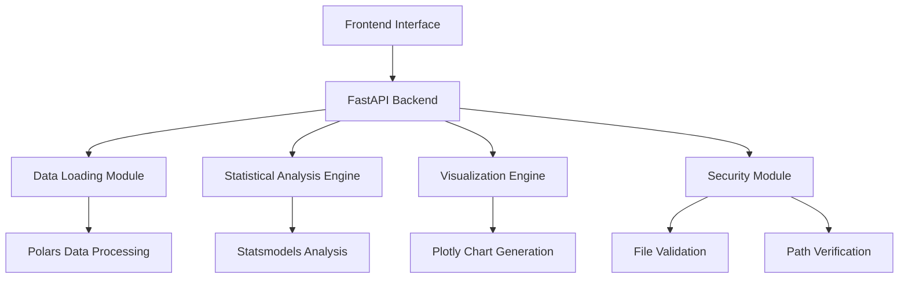

# 数据分析报告系统

欢迎使用数据分析报告系统！这是一个基于Web的自动化数据分析和报告工具，专门为时间序列数据设计。

## 🚀 主要特性

- **多格式支持**: 支持CSV和Parquet文件格式
- **智能分析**: 自动检测时间列，进行时间序列分析
- **丰富可视化**: 提供时序图、相关性热力图、分布图等多种图表
- **安全可靠**: 内置文件安全检查和路径验证
- **易于使用**: 直观的Web界面，支持文件上传和服务器文件选择
- **高性能**: 基于Polars和FastAPI构建，处理大数据集高效

## 📊 分析功能

### 统计分析
- 描述性统计（均值、中位数、标准差等）
- 缺失值分析
- 相关系数矩阵
- 时间序列平稳性检验（ADF检验）

### 可视化图表
- 时序曲线图
- 相关性热力图
- 数据分布直方图
- 箱形图
- 交互式图表（缩放、平移、悬停提示）

## 🏗️ 技术架构



## 🛠️ 技术栈

- **后端**: FastAPI + Python 3.11+
- **数据处理**: Polars + NumPy
- **统计分析**: Statsmodels
- **可视化**: Plotly
- **前端**: HTML5 + CSS3 + JavaScript
- **部署**: Docker + Nginx
- **监控**: Prometheus

## 📖 快速开始

1. **安装依赖**
   ```bash
   uv sync --group docs
   ```

2. **启动服务**
   ```bash
   uvicorn main:app --reload
   ```

3. **访问应用**
   打开浏览器访问 `http://localhost:8000`

## 📚 文档导航

- [安装指南](getting-started/installation.md) - 详细的安装和配置说明
- [基本使用](getting-started/basic-usage.md) - 快速上手指南
- [API文档](api/overview.md) - 完整的API接口文档
- [开发指南](development/environment.md) - 开发环境搭建和代码贡献
- [部署运维](deployment/deployment.md) - 生产环境部署指南

## 🤝 贡献

我们欢迎任何形式的贡献！请查看[贡献指南](development/contributing.md)了解如何参与项目开发。

## 📄 许可证

本项目采用 MIT 许可证。详情请查看 [LICENSE](https://github.com/your-username/data_report/blob/main/LICENSE) 文件。

## 📞 支持

如果您遇到问题或有任何建议，请：

- 提交 [GitHub Issue](https://github.com/your-username/data_report/issues)
- 查看[故障排除指南](deployment/troubleshooting.md)
- 联系开发团队

---

*最后更新: {{ git.date.strftime('%Y-%m-%d') }}*