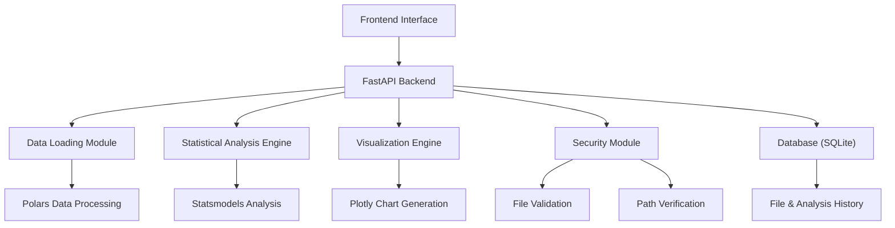

# 数据分析报告系统

欢迎使用数据分析报告系统！这是一个基于Web的自动化数据分析和报告工具，专门为时间序列数据设计。

## 🚀 主要特性

- **多格式支持**: 支持CSV和Parquet文件格式
- **智能分析**: 自动检测时间列，进行时间序列分析
- **丰富可视化**: 提供时序图、相关性热力图、分布图等多种图表
- **安全可靠**: 内置文件安全检查和路径验证
- **易于使用**: 直观的Web界面，支持文件上传和服务器文件选择
- **高性能**: 基于Polars和FastAPI构建，处理大数据集高效
- **历史记录**: 保存和查询历史分析结果

## 📊 分析功能

### 统计分析
- 描述性统计（均值、中位数、标准差等）
- 缺失值分析
- 相关系数矩阵
- 时间序列平稳性检验（ADF检验）

### 可视化图表
- 时序曲线图
- 相关性热力图
- 数据分布直方图
- 箱形图
- 交互式图表（缩放、平移、悬停提示）

## 🏗️ 技术架构



## 🛠️ 技术栈

- **后端**: FastAPI + Python 3.11+
- **数据处理**: Polars + NumPy
- **统计分析**: Statsmodels
- **可视化**: Plotly
- **数据库**: SQLite (via aiosqlite & SQLAlchemy)
- **前端**: HTML5 + CSS3 + JavaScript
- **部署**: Docker + Nginx
- **监控**: Prometheus

## 📖 快速开始

1. **安装依赖**
   ```bash
   uv sync --all-groups
   ```

2. **启动服务**
   ```bash
   uvicorn main:app --reload
   ```

3. **访问应用**
   打开浏览器访问 `http://localhost:8000`

## 📚 文档导航

- **入门指南**
    - [安装指南](getting-started/installation.md)
    - [快速上手](getting-started/quick-start.md)
    - [基本使用](getting-started/basic-usage.md)
    - [配置说明](getting-started/configuration.md)
- **用户手册**
    - [界面指南](user-guide/interface.md)
    - [结果解读](user-guide/result-interpretation.md)
- **API 文档**
    - [API 概览](api/overview.md)
    - [端点详解](api/endpoints.md)
    - [数据模型](api/data-models.md)
- **开发**
    - [环境设置](development/setup.md)
    - [贡献指南](development/contributing.md)
    - [测试指南](development/testing.md)
- **架构**
    - [系统概览](architecture/overview.md)
    - [技术栈](architecture/tech-stack.md)
    - [数据流](architecture/data-flow.md)
- **部署**
    - [部署指南](deployment/deployment.md)
    - [Docker 指南](deployment/docker.md)
    - [故障排除](deployment/troubleshooting.md)

## 🤝 贡献

我们欢迎任何形式的贡献！请查看[贡献指南](development/contributing.md)了解如何参与项目开发。

## 📄 许可证

本项目采用 MIT 许可证。详情请查看 [LICENSE](https://github.com/your-username/data_report/blob/main/LICENSE) 文件。
