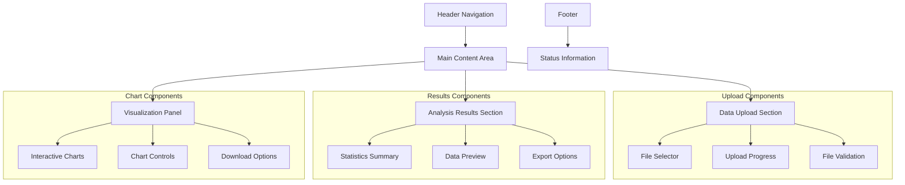

# 用户界面指南

本文档详细介绍数据分析报告系统的用户界面设计和使用方法。

## 界面概览

数据分析报告系统采用简洁直观的Web界面设计，主要包含以下几个区域：

### 主要界面组件



## 页面布局

### 1. 顶部导航栏

- **系统标题**: 显示应用名称和版本信息
- **导航菜单**: 快速访问不同功能模块
- **状态指示器**: 显示系统运行状态

### 2. 数据上传区域

#### 文件上传组件

- **拖拽上传**: 支持拖拽文件到指定区域
- **点击选择**: 点击按钮打开文件选择对话框
- **进度显示**: 实时显示上传进度
- **格式验证**: 自动检查文件格式和大小

```html
<!-- 上传区域示例 -->
<div class="upload-area">
    <div class="upload-zone" id="dropZone">
        <i class="upload-icon">📁</i>
        <p>拖拽文件到此处或点击选择文件</p>
        <input type="file" id="fileInput" accept=".csv,.parquet" hidden>
        <button class="upload-btn">选择文件</button>
    </div>
    <div class="upload-progress" id="progressBar" style="display: none;">
        <div class="progress-fill"></div>
        <span class="progress-text">0%</span>
    </div>
</div>
```

#### 服务器文件选择

- **文件列表**: 显示服务器上可用的数据文件
- **文件信息**: 显示文件大小、修改时间等信息
- **预览功能**: 支持文件内容预览

### 3. 分析结果区域

#### 统计摘要面板

- **基础统计**: 显示数据的基本统计信息
- **数据质量**: 显示缺失值、异常值等信息
- **变量信息**: 显示变量类型和分布

#### 数据预览表格

- **分页显示**: 支持大数据集的分页浏览
- **排序功能**: 支持按列排序
- **筛选功能**: 支持数据筛选和搜索

### 4. 可视化面板

#### 图表展示区域

- **多图表支持**: 同时显示多个图表
- **交互功能**: 支持缩放、平移、选择等交互
- **响应式设计**: 自适应不同屏幕尺寸

#### 图表控制面板

- **图表类型选择**: 切换不同的图表类型
- **参数调整**: 调整图表的显示参数
- **导出选项**: 支持多种格式的图表导出

## 交互功能

### 1. 文件操作

#### 上传交互

```javascript
// 拖拽上传示例
const dropZone = document.getElementById('dropZone');

dropZone.addEventListener('dragover', (e) => {
    e.preventDefault();
    dropZone.classList.add('drag-over');
});

dropZone.addEventListener('drop', (e) => {
    e.preventDefault();
    dropZone.classList.remove('drag-over');
    const files = e.dataTransfer.files;
    handleFileUpload(files[0]);
});
```

#### 文件验证

- **格式检查**: 自动检查文件扩展名
- **大小限制**: 检查文件大小是否超出限制
- **内容验证**: 验证文件内容格式

### 2. 数据交互

#### 表格操作

- **排序**: 点击列标题进行排序
- **筛选**: 使用筛选器筛选数据
- **选择**: 支持行选择和批量操作

#### 图表交互

- **缩放**: 鼠标滚轮缩放图表
- **平移**: 拖拽移动图表视图
- **选择**: 框选数据点进行详细分析
- **悬停**: 显示数据点详细信息

### 3. 导出功能

#### 数据导出

- **CSV格式**: 导出处理后的数据
- **Excel格式**: 导出带格式的数据表
- **JSON格式**: 导出结构化数据

#### 图表导出

- **PNG格式**: 导出高质量图片
- **SVG格式**: 导出矢量图形
- **PDF格式**: 导出完整报告

## 响应式设计

### 桌面端布局

- **多列布局**: 充分利用屏幕空间
- **侧边栏**: 显示详细的控制选项
- **工具栏**: 提供快捷操作按钮

### 移动端适配

- **单列布局**: 适应小屏幕显示
- **折叠菜单**: 节省屏幕空间
- **触摸优化**: 优化触摸操作体验

```css
/* 响应式设计示例 */
@media (max-width: 768px) {
    .main-content {
        flex-direction: column;
    }
    
    .sidebar {
        width: 100%;
        order: -1;
    }
    
    .chart-container {
        height: 300px;
    }
}
```

## 可访问性设计

### 键盘导航

- **Tab导航**: 支持键盘Tab键导航
- **快捷键**: 提供常用功能的快捷键
- **焦点指示**: 清晰的焦点指示器

### 屏幕阅读器支持

- **语义化标签**: 使用正确的HTML语义标签
- **ARIA标签**: 添加必要的ARIA属性
- **替代文本**: 为图表提供文字描述

### 颜色和对比度

- **高对比度**: 确保足够的颜色对比度
- **色盲友好**: 使用色盲友好的颜色方案
- **暗色模式**: 支持暗色主题切换

## 性能优化

### 加载优化

- **懒加载**: 图表和大数据的懒加载
- **缓存策略**: 合理的缓存机制
- **压缩**: 资源文件压缩

### 交互优化

- **防抖**: 搜索和筛选的防抖处理
- **虚拟滚动**: 大数据集的虚拟滚动
- **异步处理**: 耗时操作的异步处理

## 错误处理

### 用户友好的