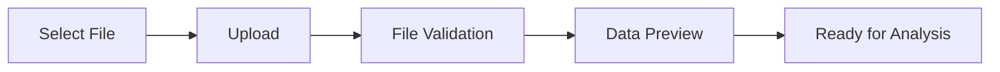

# 快速开始

欢迎使用数据分析报告系统！本指南将帮助您快速上手，在几分钟内完成第一个数据分析报告。

## 系统要求

在开始之前，请确保您的系统满足以下要求：

- **操作系统**: Windows 10+, macOS 10.15+, 或 Linux (Ubuntu 18.04+)
- **Python**: 3.11 或更高版本
- **内存**: 至少 4GB RAM (推荐 8GB+)
- **存储**: 至少 2GB 可用空间
- **浏览器**: Chrome 90+, Firefox 88+, Safari 14+, 或 Edge 90+

## 安装方式

### 方式一：Docker 部署（推荐）

这是最简单的部署方式，适合快速体验和生产环境使用。

#### 1. 安装 Docker

如果您还没有安装 Docker，请访问 [Docker 官网](https://www.docker.com/get-started) 下载并安装。

#### 2. 拉取并运行容器

```bash
# 拉取最新镜像
docker pull data-report:latest

# 运行容器
docker run -d \
  --name data-report \
  -p 8000:8000 \
  -v $(pwd)/data:/app/data \
  -v $(pwd)/reports:/app/reports \
  data-report:latest
```

#### 3. 访问应用

打开浏览器，访问 `http://localhost:8000`，您应该能看到系统主页。

### 方式二：本地开发安装

适合开发者或需要自定义配置的用户。

#### 1. 克隆代码库

```bash
git clone https://github.com/your-org/data-report.git
cd data-report
```

#### 2. 安装依赖

使用 uv（推荐）：

```bash
# 安装 uv（如果还没有安装）
curl -LsSf https://astral.sh/uv/install.sh | sh

# 安装项目依赖
uv sync
```

或使用 pip：

```bash
# 创建虚拟环境
python -m venv venv
source venv/bin/activate  # Linux/macOS
# 或
venv\Scripts\activate     # Windows

# 安装依赖
pip install -e .
```

#### 3. 启动服务

```bash
# 使用 uv
uv run python main.py

# 或直接运行
python main.py
```

#### 4. 访问应用

打开浏览器，访问 `http://localhost:8000`。

## 第一次使用

### 步骤 1：准备数据文件

系统支持多种数据格式：

- **CSV 文件** (.csv) - 最常用的格式
- **Excel 文件** (.xlsx, .xls)
- **JSON 文件** (.json)
- **Parquet 文件** (.parquet)

#### 数据格式要求

- 第一行应为列标题
- 数据应为结构化格式
- 时间序列数据应包含日期/时间列
- 数值列应为数字格式

#### 示例数据

如果您没有现成的数据，可以使用系统提供的示例数据：

```csv
date,product,quantity,price,total,region
2023-01-01,Product A,10,99.99,999.90,North
2023-01-02,Product B,15,149.99,2249.85,South
2023-01-03,Product A,8,99.99,799.92,East
2023-01-04,Product C,20,79.99,1599.80,West
2023-01-05,Product B,12,149.99,1799.88,North
```

### 步骤 2：上传数据文件

1. 在主页点击 **"上传数据文件"** 按钮
2. 选择您的数据文件或拖拽文件到上传区域
3. 等待文件上传完成
4. 系统会自动检测文件格式和数据结构



### 步骤 3：数据预览和验证

上传完成后，系统会显示：

- **文件信息**: 文件名、大小、行数、列数
- **数据预览**: 前几行数据样本
- **列信息**: 每列的数据类型、缺失值统计
- **数据质量**: 数据质量评分和建议

### 步骤 4：选择分析类型

根据您的数据和分析需求，选择合适的分析类型：

#### 基础统计分析
- **描述性统计**: 均值、中位数、标准差等
- **分布分析**: 数据分布形状、正态性检验
- **相关性分析**: 变量间的相关关系

#### 高级分析
- **异常值检测**: 识别数据中的异常点
- **时间序列分析**: 趋势、季节性、预测
- **聚类分析**: 数据分组和模式识别

#### 快速分析（推荐新手）
选择 **"智能分析"**，系统会根据数据特征自动选择合适的分析方法。

### 步骤 5：配置分析参数

根据选择的分析类型，配置相关参数：

#### 基础统计分析参数
- **分析列**: 选择要分析的数值列
- **置信水平**: 通常选择 95% 或 99%
- **是否包含异常值**: 建议保持开启

#### 时间序列分析参数
- **时间列**: 选择包含日期/时间的列
- **数值列**: 选择要分析的指标
- **预测期数**: 需要预测的未来时间点数量

### 步骤 6：开始分析

1. 点击 **"开始分析"** 按钮
2. 系统会显示分析进度
3. 分析完成后会自动跳转到结果页面

分析时间取决于数据大小和分析复杂度，通常在几秒到几分钟之间。

### 步骤 7：查看分析结果

分析完成后，您可以看到：

#### 统计摘要
- 关键指标概览
- 数据质量评估
- 主要发现总结

#### 详细结果
- **统计表格**: 详细的统计数据
- **可视化图表**: 直方图、箱线图、散点图等
- **分析解读**: 对结果的专业解释

#### 交互功能
- **图表缩放**: 点击图表可以放大查看
- **数据筛选**: 可以筛选特定时间段或类别
- **导出功能**: 支持导出图表和数据

### 步骤 8：生成报告

1. 在结果页面点击 **"生成报告"** 按钮
2. 选择报告模板（或使用默认模板）
3. 自定义报告内容和格式
4. 点击 **"生成"** 开始创建报告

#### 报告格式选项
- **PDF**: 适合打印和正式分享
- **HTML**: 适合在线查看和交互
- **Word**: 适合进一步编辑
- **PowerPoint**: 适合演示汇报

### 步骤 9：下载和分享

报告生成完成后：

1. **下载报告**: 点击下载按钮保存到本地
2. **在线分享**: 生成分享链接，可设置访问权限
3. **邮件发送**: 直接通过邮件发送给相关人员

## 常见问题

### Q: 支持哪些数据文件格式？

A: 系统支持 CSV、Excel (.xlsx, .xls)、JSON 和 Parquet 格式。推荐使用 CSV 格式以获得最佳兼容性。

### Q: 文件大小有限制吗？

A: 单个文件最大支持 1GB。如果文件较大，建议先进行数据预处理或分批上传。

### Q: 如何处理包含中文的数据？

A: 系统完全支持中文数据。上传 CSV 文件时，请确保使用 UTF-8 编码。

### Q: 分析结果可以保存多久？

A: 分析结果默认保存 30 天。您可以在设置中调整保存期限或手动删除不需要的结果。

### Q: 可以同时分析多个文件吗？

A: 目前支持单文件分析。如需分析多个文件，请分别上传或将数据合并到一个文件中。

### Q: 如何获得更准确的分析结果？

A: 建议：
- 确保数据质量，减少缺失值和错误数据
- 选择合适的分析方法
- 根据业务需求调整分析参数
- 结合领域知识解读结果

## 下一步

完成第一次分析后，您可以：

1. **探索高级功能**: 尝试更复杂的分析类型
2. **自定义报告模板**: 创建符合您需求的报告格式
3. **设置定期分析**: 对定期更新的数据设置自动分析
4. **学习结果解读**: 查看 [结果解读指南](result-interpretation.md) 深入理解分析结果
5. **API 集成**: 通过 API 将分析功能集成到您的系统中

## 获取帮助

如果您在使用过程中遇到问题：

- **用户界面指南**: [界面介绍](interface.md)
- **结果解读帮助**: [结果解读指南](result-interpretation.md)
- **API 文档**: [API 参考](../api/endpoints.md)
- **故障排除**: [常见问题解决](../deployment/troubleshooting.md)

---

**提示**: 建议先使用示例数据熟悉系统功能，然后再使用您的实际业务数据进行分析。

祝您使用愉快！如有任何问题，欢迎随时联系我们的技术支持团队。