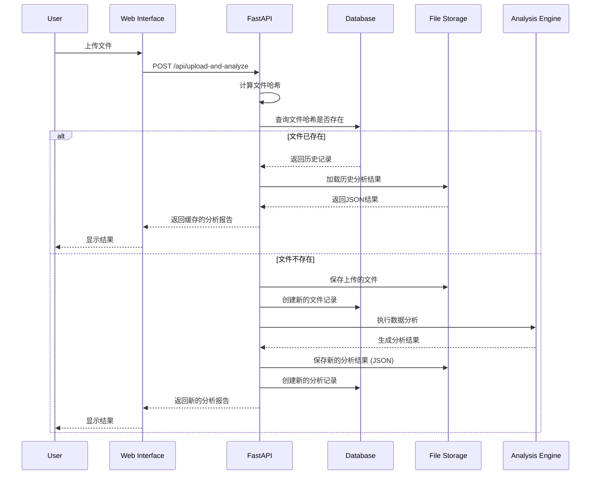

# 数据分析报告系统 - 项目架构分析报告

## 项目概述

这是一个基于Web的自动化数据分析和报告工具，专门为时间序列数据设计。系统提供了完整的数据分析流程，包括数据加载、统计分析、可视化生成和结果展示，支持CSV和Parquet文件格式。

## 整体架构

### 系统架构图

```mermaid
graph TB
    subgraph Client["客户端层"]
        A[Web浏览器]
        B[移动设备]
    end
    
    subgraph LoadBalancer["负载均衡层"]
        C[Nginx]
    end
    
    subgraph Application["应用层"]
        D[FastAPI应用]
        E[静态文件服务]
    end
    
    subgraph Business["业务逻辑层"]
        F[数据加载模块]
        G[统计分析引擎]
        H[可视化引擎]
        I[安全模块]
        M[历史记录管理器]
    end
    
    subgraph Processing["数据处理层"]
        J[Polars数据处理]
        K[NumPy数值计算]
        L[Statsmodels统计]
        P[Plotly可视化]
    end
    
    subgraph Storage["存储层"]
        N[文件系统 (上传与结果)]
        O[数据库 (SQLite)]
        Q[日志存储]
    end
    
    subgraph Monitoring["监控层"]
        R[Prometheus]
        S[日志系统]
    end
    
    A --> C
    B --> C
    C --> D
    C --> E
    D --> F
    D --> G
    D --> H
    D --> I
    D --> M
    F --> J
    G --> K
    G --> L
    H --> P
    F --> N
    M --> N
    M --> O
    D --> Q
    D --> S
```

### 架构层次

1. **表现层**: HTML5 + CSS3 + JavaScript, Jinja2
2. **应用层**: FastAPI, Uvicorn
3. **业务逻辑层**: 数据处理、统计分析、可视化、安全控制、历史管理
4. **数据访问层**: 文件系统, SQLite数据库
5. **基础设施层**: Python 3.11+, Docker, Nginx

## 核心组件

### 1. Web应用层 (FastAPI)
- **职责**: 提供HTTP API接口和Web服务
- **核心功能**: RESTful API, 异步请求处理, 自动API文档, 请求验证, 异常处理
- **主要文件**: [`main.py`](main.py:1)

### 2. 数据加载模块
- **职责**: 处理文件上传、读取和预处理
- **核心功能**: 多格式支持 (CSV, Parquet), 编码检测, 时间列识别, 数据类型推断
- **主要文件**: [`src/reporter/data_loader.py`](src/reporter/data_loader.py:1)

### 3. 统计分析引擎
- **职责**: 执行各种统计分析和计算
- **核心功能**: 描述性统计, 相关性分析, 时间序列检验, 缺失值分析
- **主要文件**: [`src/reporter/analysis/basic_stats.py`](src/reporter/analysis/basic_stats.py:1), [`src/reporter/analysis/time_series.py`](src/reporter/analysis/time_series.py:1)

### 4. 可视化引擎
- **职责**: 生成交互式图表和可视化
- **核心功能**: 时序图, 热力图, 分布图, 箱形图
- **主要文件**: [`src/reporter/visualization/charts.py`](src/reporter/visualization/charts.py:1)

### 5. 安全模块
- **职责**: 确保系统安全和数据保护
- **核心功能**: 文件类型验证, 路径遍历防护, 文件大小限制
- **主要文件**: [`src/reporter/security.py`](src/reporter/security.py:1)

### 6. 历史记录与存储
- **职责**: 管理文件上传和分析的历史记录，并提供缓存功能
- **组件**:
  - **数据库 (SQLite)**: 使用 `aiosqlite` 存储文件元数据和分析记录
  - **文件系统**: 存储上传的原始文件和生成的分析结果 (JSON格式)
- **主要文件**: [`src/reporter/database.py`](src/reporter/database.py:1), [`src/reporter/file_manager.py`](src/reporter/file_manager.py:1)

### 7. 任务管理器
- **职责**: 管理异步分析任务的生命周期
- **核心功能**: 任务创建、调度、进度跟踪、结果存储
- **主要文件**: [`src/reporter/tasks/task_manager.py`](src/reporter/tasks/task_manager.py:1)

### 8. 配置管理
- **职责**: 管理应用配置和环境变量
- **核心功能**: 多环境配置支持、配置验证、热重载
- **主要文件**: [`src/reporter/config/config_manager.py`](src/reporter/config/config_manager.py:1)

## 技术栈

### 后端技术
- **Web框架**: FastAPI - 高性能异步Web框架
- **ASGI服务器**: Uvicorn - ASGI服务器实现
- **数据处理**: Polars - 高性能数据处理库
- **数值计算**: NumPy - 科学计算基础库
- **统计分析**: Statsmodels - 统计建模和测试
- **数据库**: SQLite + aiosqlite - 轻量级异步数据库
- **异步编程**: asyncio - Python异步编程支持

### 前端技术
- **HTML5/CSS3**: 现代网页结构和样式
- **JavaScript**: 前端交互逻辑
- **Plotly**: 交互式图表库
- **响应式设计**: 支持多设备访问

### 部署和运维
- **容器化**: Docker + Docker Compose
- **Web服务器**: Nginx - 反向代理和静态文件服务
- **进程管理**: Gunicorn + UvicornWorker - WSGI应用服务器
- **系统服务**: systemd - Linux系统服务管理
- **监控**: Prometheus + Grafana - 应用监控和可视化

### 开发和测试
- **包管理**: uv - 现代Python包管理器
- **测试框架**: pytest - Python测试框架
- **端到端测试**: Playwright - 浏览器自动化测试
- **代码质量**: ruff, mypy - 代码格式化和类型检查

## 数据流架构

### 文件上传与分析流程



## 项目结构

```
data_analysis_report/
│
├── main.py                     # 🚀 FastAPI应用主文件，包含API路由
├── pyproject.toml              # (推荐) 项目依赖与配置管理
│
├── src/
│   └── reporter/
│       ├── __init__.py
│       │
│       ├── analysis/           # 分析功能集合
│       │   ├── __init__.py
│       │   ├── basic_stats.py  # 基础统计分析
│       │   ├── time_series.py  # 时间序列分析
│       │   └── parallel_processor.py  # 并行处理
│       │
│       ├── visualization/      # 可视化功能集合
│       │   ├── __init__.py
│       │   ├── charts.py       # 图表生成
│       │   └── theme.py        # 图表主题
│       │
│       ├── data_loader.py      # 数据加载模块
│       ├── database.py         # 数据库模块
│       ├── security.py         # 安全模块
│       ├── file_manager.py     # 文件管理模块
│       ├── tasks/              # 任务管理
│       │   ├── __init__.py
│       │   └── task_manager.py # 异步任务管理器
│       ├── config/             # 配置管理
│       │   ├── __init__.py
│       │   └── config_manager.py # 配置管理器
│       └── utils/              # 工具函数
│           ├── __init__.py
│           └── performance.py   # 性能监控
│
├── static/                     # 存放前端静态文件
│   └── app.js                  # 主要的JavaScript逻辑
│   └── styles.css              # CSS样式
│
├── templates/                  # HTML模板
│   └── index.html              # 主页面HTML模板
│
├── tests/                      # 测试文件
│   ├── test_basic_stats.py     # 基础统计测试
│   ├── test_data_loader.py     # 数据加载测试
│   ├── test_security.py        # 安全模块测试
│   └── e2e/                   # 端到端测试
│       ├── test_browser_workflow.py
│       └── playwright.config.py
│
├── docs/                       # 文档
│   ├── index.md
│   ├── architecture/           # 架构文档
│   ├── api/                    # API文档
│   ├── getting-started/       # 入门指南
│   └── mkdocs.yml             # 文档配置
│
├── config/                     # 配置文件
│   └── default.json           # 默认配置
│
├── docker-compose.yml          # Docker Compose配置
├── Dockerfile                  # Docker镜像配置
├── nginx/                      # Nginx配置
│   └── nginx.conf
└── systemd/                    # 系统服务配置
    └── data-report.service
```

## 部署架构

### Docker部署架构

系统使用Docker Compose编排多个服务：

1. **data-report-app**: 主应用服务
   - 基于Python 3.11构建
   - 使用Gunicorn + UvicornWorker作为ASGI服务器
   - 挂载数据和日志目录

2. **nginx**: 反向代理服务
   - 提供HTTPS支持
   - 静态文件服务
   - 请求路由和负载均衡

3. **monitoring**: Prometheus监控服务
   - 收集应用指标
   - 提供查询接口

4. **grafana**: 可视化监控服务
   - 展示监控仪表板
   - 告警配置

### 系统服务部署

对于生产环境，系统提供了systemd服务配置文件：
- 使用专用用户运行
- 资源限制和安全设置
- 自动重启机制

## 安全设计

1. **文件安全**:
   - 文件类型验证 (仅允许CSV和Parquet)
   - 文件大小限制
   - 路径遍历攻击防护

2. **Web安全**:
   - HTTPS强制重定向
   - 安全HTTP头设置
   - 请求大小限制

3. **系统安全**:
   - 非root用户运行
   - 文件系统权限限制
   - 系统调用限制

## 性能优化

1. **数据处理**:
   - 使用Polars进行高性能数据处理
   - 大数据集采样和分块处理
   - 并行计算支持

2. **可视化**:
   - 图表数据采样
   - 异步图表生成
   - 响应式设计

3. **缓存机制**:
   - 文件哈希缓存
   - 分析结果缓存
   - 静态资源缓存

## 总结

这个数据分析报告系统是一个设计良好、架构清晰的Web应用，具有以下特点：

1. **模块化设计**: 各功能模块职责明确，耦合度低
2. **高性能**: 使用Polars和异步处理，支持大数据集分析
3. **安全可靠**: 多层安全设计，保护系统和数据安全
4. **易于部署**: 支持Docker和系统服务多种部署方式
5. **完整监控**: 集成Prometheus和Grafana监控系统状态
6. **用户友好**: 直观的Web界面，支持多种设备访问

系统整体采用现代化的技术栈，遵循最佳实践，是一个高质量的数据分析工具。